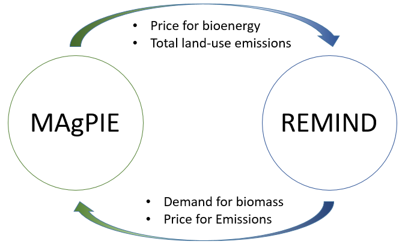
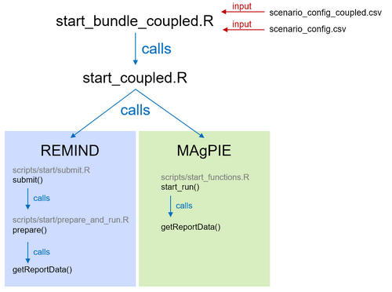

Running REMIND and MAgPIE in coupled mode
================
David Klein (<dklein@pik-potsdam.de>)

- [Running REMIND and MAgPIE in coupled mode](#running-remind-and-magpie-in-coupled-mode)
- [How to start coupled runs](#how-to-start-coupled-runs)
    + [Clone the models](#clone-the-models)
    + [Switch to relevant branchs](#switch-to-relevant-branchs)
    + [What happens during a single coupled run](#what-happens-during-a-single-coupled-run)
    + [What happens during a bundle of coupled runs](#what-happens-during-a-bundle-of-coupled-runs)
    + [Configure start_bundle_coupled.R](#configure-start_bundle_coupledr)
    + [Configure the config files of your choice](#configure-the-config-files-of-your-choice)
    + [Perform test start before actually submitting runs](#perform-test-start-before-actually-submitting-runs)
    + [Start runs after checking that coupling scripts finds all gdxes and mifs](#start-runs-after-checking-that-coupling-scripts-finds-all-gdxes-and-mifs)
- [Check the convergence](#check-the-convergence)
- [Technical concept](#technical-concept)
    + [Dynamic part](#dynamic-part)
    + [Static part](#static-part)
    + [Assumptions](#assumptions)
    + [The coupling scripts](#the-coupling-scripts)

# How to start coupled runs

### Clone the models

If you work on the PIK cluster, first fork both https://github.com/magpiemodel/magpie.git and https://github.com/remindmodel/remind.git on your own github account, and then run
```bash
clonerempie githubuser [remindfolder]
```
If `remindfolder` is not specified, it uses "remind".

If you are not on the cluster, you can use the following to get a magpie folder within your remind folder:
```bash
git clone --filter=blob:limit=1m https://github.com/remindmodel/remind.git; cd remind; git clone https://github.com/magpiemodel/magpie.git
```

### Switch to relevant branchs

For both models switch to the git branches you want to use for your runs, for example the `develop` branch for most recent developments, or the `master` branch for a stable release:

```bash
git checkout develop
```

### What happens during a single coupled run

You can find a more technical explanation in the sections below, but the start script is essentially creating new runs of each model that use previous runs as input. These runs' names follow a specific pattern of suffixes and prefixes, and "communicate" through ".mif" reporting files.

<a href="figures/4-REMIND-MAgPIE-circle.png"></a>

Here's an example of a simple case. If you start a new coupled run with the scenario name `Base`, which doesn't depend on any other run, the script will:

   - Set up and start a normal REMIND run called `C_Base-rem-1`, based on the configurations in `scenario_config.csv`
   - After that REMIND run finishes, set up a MAgPIE run, in the MAgPIE folder you defined in `path_magpie`, called `C_Base-mag-1`. This run will be configured to:
      - Take the bioenergy demands and GHG prices from the previous REMIND run's reporting output, in `path_remind/output/C_SSP2EU-Base-rem-1/REMIND_generic_C_SSP2EU-Base-rem-1.mif`
      - Take other MAgPIE configurations from the `magpie_scen` column in `scenario_config_coupled.csv`.
   - After that MAgPIE run finishes, start another REMIND run with the name `C_Base-rem-2`, which will:
      - Take initial conditions from the `fulldata.gdx` of the previous REMIND run, `C_Base-rem-1`.
      - Take bioenergy prices and land-use GHG emissions from the previous MAgPIE run's reporting output, in `path_magpie/output/C_Base-mag-1/report.mif`

This process will continue until for as many iterations as set in `max_iterations` in `start_bundle_coupled.R` (see Check the Convergence below). The last iteration will run REMIND only, so REMIND will have run `max_iterations` times and MAgPIE wil have run `max_iterations - 1` times. So, if `max_iterations` is 5, the last REMIND run in this case will be `C_Base-rem-5` and the last MAgPIE iteration will be `C_Base-mag-4`.

The output of both models can be analyzed normally from these two runs. The REMIND `.mif` file contains also the MAgPIE variables. Additionally, at the end of a successful coupled run the coupling script will automatically merge the reports of the last runs of both models in a `.mif` file located in the root of REMIND's output folder, using the joint model name "REMIND-MAgPIE". In our example, that file will be `path_remind/output/C_SSP-Base.mif`.

So, in the end of the coupled run in this example, you should have a directory structure like:

```
|-- path_remind       # the path to the REMIND model folder
|   |-- output
|       |-- C_Base-rem-1
|       |-- C_Base-rem-2
|       |-- C_Base-rem-3
|       |-- C_Base-rem-4
|       |-- C_Base-rem-5
|       |-- C_Base.mif

|-- path_magpie       # the path to the MAgPIE model folder set in start_bundle_coupled.R
|   |-- output
|       |-- C_Base-mag-1
|       |-- C_Base-mag-2
|       |-- C_Base-mag-3
|       |-- C_Base-mag-4
```

### What happens during a bundle of coupled runs

Make sure you have read and understood [`03_RunningBundleOfRuns`](./03_RunningBundleOfRuns.md).
After Base-rem-1 run is finished, the policy run (NDC-rem-1) is already started as well as Base-rem-2, etc.
So `NDC-rem-1` uses the `fulldata.gdx` from `Base-rem-1` as `path_gdx_ref`, while `NDC-rem-2` uses `Base-rem-2` and so on:

```
Base-rem-1 -> Base-rem-2   -> Base-rem-3   -> Base-rem-4
            ↳ NDC-rem-1    -↳ NDC-rem-2    -↳ NDC-rem-3    -↳ NDC-rem-4
                            ↳ Policy-rem-1 -↳ Policy-rem-2 -↳ Policy-rem-3 -↳ Policy-rem-4
```
Each REMIND run has its own cluster job and should require around 4 to 10 hours. On the PIK cluster, this allows to use `priority` and `short` jobs.
Once `Policy-rem-1` is finished, you have a full set of preliminary data available, while the later rem-2 etc. are still running.

### Configure start_bundle_coupled.R

See comments in the head section of the file. Most importantly you need to provide the path to MAgPIE.

### Configure the config files of your choice

Required as `path_settings_coupled` is a file from [`./config/`](../config) that starts with `scenario_config_coupled*.csv` and provides some extra information for coupled runs (e.g. which run should be started, specific MAgPIE configurations), with one scenario per row and settings on the columns. `path_settings_remind` is a normal `scenario_config` that defines all other REMIND settings, as explained in [`03_RunningBundleOfRuns`](./03_RunningBundleOfRuns.md). Every scenario to be run must be present in both files.

All the columns must be present in the `scenario_config_coupled.csv` file, but most of them can be left blank. The required ones are:

   - `title`: The name of the scenario, must be unique and match the `title` column in REMIND's `scenario_config.csv`
   - `start`: Defines if a scenario run should be started (1) or not (0). Overrides whatever is set in REMIND's `scenario_config*.csv`. If you have an unfinished coupled run, it will automatically try to continue from the last coupling iteration (i.e. REMIND or MAgPIE run), if it is not finished yet (i.e. reached `max_iterations`).
   - `qos`: The SLURM qos the coupled runs should be submitted to, such as `priority`, `short`, `medium`, `long` or `standby` on the PIK cluster. If you use `auto`, the qos is set to `priority` if an empty slot exists, and `short` otherwise. This is also the default if no `qos` is set. Currently, there is no default support for running a coupled run locally.   
   - `magpie_scen`: A pipe (`|`) separated list of configurations to pass to MAgPIE. Each entry should correspond to a column in [MAgPIE's scenario_config](https://github.com/magpiemodel/magpie/blob/master/config/scenario_config.csv), each one of them setting the multiple configuration flags listed in that file. The configurations are applied in the order that they appear. For example, to configure MAgPIE with SSP2 settings and climate change impacts according to RCP45 set `magpie_scen` to `SSP2|cc|rcp4p5`. To select scenarios from a different `scenario_config*.csv` file replace `magpie_scen` by the path to that file relative to MAgPIE's main folder, for example: `config/projects/scenario_config_PROJECT.csv`. The filename *must contain* the string `scenario_config`. You can also specify more than one column directing to another `scenario_config_PROJECT2.csv` file. They will be evaluated in the order in which they appear in the `scenario_config_coupled.csv`. There is another option of addressing MAgPIE switches described at the end of the list of optional columns below.
   - `no_ghgprices_land_until`: Controls at which timestep in the MAgPIE runs GHG prices from REMIND will start to be applied. This essentially enables you to set whether or not (or when) GHG prices on land should be applied in MAgPIE. If you want MAgPIE to always apply the same GHG prices from REMIND, you should set this to a timestep corresponding to the start of your REMIND run, such as `y2020` to start in the 2020 timestep. If you want to disable GHG prices in MAgPIE, regardless of what REMIND finds, set this to the last timestep of the run (usually `y2150`). Values in between allow the simulation of policies where GHG prices are only applied in the land use sector after a certain year.

Other, optional columns allow you to make a run start only after another has finished, set starting conditions, and give you finer control over which data is fed from REMIND to MAgPIE or from MAgPIE to REMIND.

   - `path_gdx`, `path_gdx_ref`, `path_gdx_refpolicycost`, `path_gdx_carbonprice`, `path_gdx_bau`: If cell is non-empty, override these same settings in REMIND's `scenario_config`, see [`03_RunningBundleOfRuns`](./03_RunningBundleOfRuns.md) for a detailed explanation. Note that if the `path_gdx_refpolicycost` column is missing, it is *not* copied from `path_gdx_ref` as is the case for the normal config file. If you specify `path_gdx_ref`, always specify `path_gdx_refpolicycost`.
      - You can set these switches either to the full path of a `fulldata.gdx` file or simply to the name of another scenario in the file (without the "C_"!). So if you want a certain scenario (say `NDC`) to use as starting point the results of a `Base` scenario, you can simply set `path_gdx` to `Base` and it will automatically locate the appropriate `fulldata.gdx` in `Base`, for example `path_remind/C_Base-rem-x/fulldata.gdx`.
      - If you set any of these `path_gdx…` columns (or `path_mif_ghgprice_land`, below) with a scenario name such as `Base`, the coupling script will not start any runs that depend on an unfinished run, and automatically start them when that run finishes. So, in the example above, you can set `start` to `1` in both `Base` and `NDC`, `NDC` will only start *after* `Base` is finished. `NDC-rem-2` will start after `NDC-rem-1` and `Base-rem-2` are finished.
      - If you set any of these settings with a scenario name, the script will automatically try to detect whether the required "parent" run including the reporting is already finished and uses the appropriate `fulldata.gdx` then.
      - You can also set it to `C_Base-rem-3` if for some reason, you want the results of a specific iteration.
      - `path_gdx`: if you provide a full path to a fulldata.gdx this will overwrite whatever might have been automatically found from former REMIND runs. 
   - `path_mif_ghgprice_land`: This setting allows MAgPIE to be run using an exogenous, fixed GHG price path, regardless of the GHG price in the REMIND coupling. This can be useful if you want to simulate different GHG pricing policies in the land-use sector. Its timing is also controlled by `no_ghgprices_land_until`.
      - As with the `path_gdx*` settings, this can be set both to the full path of a REMIND `.mif` reporting file (*not* a `.gdx`) or to the name of another scenario. If set to the name of another scenario, it will also wait for that run to finish before starting the dependent run as described.
   - `oldrun`: This setting can be used to continue a coupled run that had a different name and/or is in a different folder. It works in almost the same way as `path_gdx`, but it is used only if no REMIND run has been finished for this scenario. It will look in the path set in `start_bundle_coupled.R`'s `path_remind_oldruns`. This can be useful when continuing a previous experiment that was made in another REMIND copy, or after changing scenario names.
   - `path_report: Provide a path to a MAgPIE report here if you want REMIND to start with it. It overwrites whatever might have been automatically found from former MAgPIE runs. 
   - `cm_nash_autoconverge_lastrun`: can be used to specify `cm_nash_autoconverge`, but only for the last REMIND run, for example to increase precision there by setting it to `2`.
   - `cfg_mag$...`: If you don't want to select composed scenarios in MAgPIE to address switches, you can directly address individual MAgPIE switches in the `scenario_config_coupled.csv`. Add any number of columns to your `scenario_config_coupled.csv` that have the name of the MAgPIE switch as the column name. They need to start with `cfg_mag$`. For example: if you want to set `gms$s56_cprice_red_factor` to `3.14` for `SSP2-NPi`, add the column `cfg_mag$gms$s56_cprice_red_factor` to your `scenario_config_coupled.csv` and fill in `3.14` in the row that defines `SSP2-NPi`.
   - `var_luc`: Controls, which variable to use in REMIND to represent land-use change (LUC) CO2 emissions from MAgPIE (`co2luc` in REMIND). By default, this switch is set to `smooth` such that the variable `Emissions|CO2|Land|+|Land-use Change` is used. This variable was i.a. obtained by applying a low-pass filter to the raw LUC emissions in order to smooth out spikes. Alternatively, this switch can be set to `raw`. Then the unfiltered variable `Emissions|CO2|Land RAW|+|Land-use Change` is used instead.


### Perform test start before actually submitting runs

The `--test` (or `-t`) flag shows you if the scripts find all information that are crucial for starting the coupled runs, such as gdxes, mifs, model code. It also indicates if a run that crashed previously can be continued and where (which model, which iteration).

```bash
Rscript start_bundle_coupled.R --test
```

If you want to check whether your REMIND settings compile, run

```bash
Rscript start_bundle_coupled.R --gamscompile
```

A shortcut for these commands is `./start_bundle_coupled.R -t` and `./start_bundle_coupled.R -g`.

If you provide a coupled config file as command line argument, it overwrites the settings in `start_bundle_coupled.R`:
```bash
Rscript start_bundle_coupled.R --test config/scenario_config_coupled_XYZ.csv
```
This assumes that the REMIND settings can be found in `config/scenario_config_XYZ.csv` without the `_coupled`.

If you pass `--interactive` as a flag, the script asks you to choose the scenario to be started.

### Start runs after checking that coupling scripts finds all gdxes and mifs

```bash
Rscript start_bundle_coupled.R [configfile]
```

You can use `Rscript start_bundle_coupled.R [configfile] | tee -a start_log.txt` (or a different filename) if you want to save the log of this procedure to a file, additionally to printing it to the screen.

# Check the convergence

There is no automatic abort criterion for the coupling iterations. The number of coupling iterations is given by the user (`max_iterations` in start_bundle_coupled.R) and will be performed regardless of the quality of convergence. The convergence can be checked, however, by tracking the changes of crucial coupling variables (such as bioenergy demand and prices, GHG emissions and prices) across coupling iterations. After `max_iterations` is reached, a pdf showing these changes is produced automatically that can be found in the common `output` folder of REMIND. If you want to create this pdf for one or more scenarios specifically please provide the names of these runs as follows:

```bash
Rscript output.R
```
choosing a `comparison` and then `plot_compare_iterations`.
If the iterations you want to inspect are located in an output folder different from `output` please provide the path to this folder:

```bash
Rscript scripts/output/comparison/plot_compare_iterations.R folder=another-output-folder
```

To compare the REMIND runs, a `compareScenario2` for each scenario is produced automatically in the main folder (look for `compScen_rem-1-5_Base.pdf` or similar).
You can switch that off by setting `run_compareScenario` to `FALSE` in `start_bundle_coupled.R`.

# Compare scalars from all coupled runs

By running something like
```bash
Rscript --vanilla scripts/utils/readcoupledgdx.R cm_startyear,o_iterationNumber
```
you can get a compact overview of scalars (such as `cm_startyear`, `o_iterationNumber`, `s45_actualbudgetco2` or `cm_peakBudgYr`) for all coupled runs in your folder.
PIK cluster users can use `readcoupledgdx yourvariable` as a shortcut.

# Technical concept

There are two components of the REMIND-MAgPIE coupling: the prominent dynamic part (models solve iteratively and exchange data via coupling script), the more hidden static part (exogenous assumptions derived from the other model, updated manually from time to time via [`mrcommons`](https://github.com/pik-piam/mrcommons/blob/master/R/readMAgPIE.R)).

### Dynamic part

* bioenergy demand, GHG prices from REMIND to MAgPIE (technical: getReportData in [`startfunctions.R`](https://github.com/magpiemodel/magpie/blob/master/scripts/start_functions.R))
* bioenergy prices, GHG emissions from MAgPIE to REMIND (technical: getReportData in [`getReportData.R`](https://github.com/remindmodel/remind/blob/develop/scripts/start/getReportData.R))

### Static part

* bioenergy supply curves in REMIND derived from MAgPIE (updated in coupled runs)
* CO2 MAC: currently deactivated due to negligible differences in CO2 LUC emissions across RCPs
* CH4/N2O MAC (turned on in REMIND standalone, turned off in REMIND coupled because abatement is part of MAgPIE)
* GHG emission baselines for SSPs/RCPs (delivered to REMIND via (updated in coupled runs)
* total agricultural production costs (fixed for standalone and coupled)

Please find a detailed list of the REMIND input files and were they come from [in the gitlab wiki](https://gitlab.pik-potsdam.de/REMIND/wiki/-/wikis/Updating-Inputs-from-Magpie).

### Assumptions

* Biomass trade takes place in REMIND, i.e. biomass demand is prescribed to MAgPIE on regional level (not global).
* CH4 and N2O prices in MAgPIE are limited to the upper end of the MAC curve to avoid infeasibilities
* demand dependent bioenery tax in REMIND
* afforestation assumptions (reward for negative emissions, investment decisions (planing horizon, 20% insurance))

### The coupling scripts

The meta scripts for coupled runs that configure the models, start the runs, and perform the iteration loop, are located in the REMIND main folder.



* `start_bundle_coupled.R`
  * installs MAgPIE dependencies, ensures both REMIND and MAgPIE run in the same renv
  * reads scenario_config_coupled.csv and scenario_config.csv files and updates model cfgs accordingly
  * saves all settings (including cfgs) to individual `.RData` files in the REMIND main folder such as `C_Base-rem-x.RData`
  * sends a job to the cluster for each scenario specified in the csvs. Each job executes `start_coupled.R`.
* `start_coupled.R`
  * tries to detect runs that crashed and that can be continued
  * reads the `.RData` file and starts REMIND and MAgPIE.
  * saves the output of one model into the specific input folder of the other model
  * the models read these inputs as part of their individual start scripts
  * REMIND runs last
  * after last coupling iteration generate combined reporting file by binding REMIND and MAgPIE mifs together, and create a `compareScenario2` for REMIND, and a `plot_compare_iterations` using results of both models.
