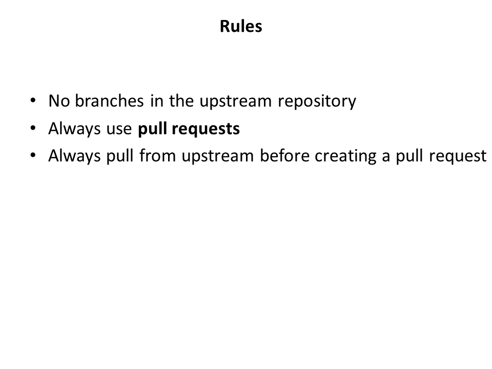

Using git and GitHub to manage your REMIND code
================
David Klein (<dklein@pik-potsdam.de>), Kristine Karstens (<karstens@pik-potsdam.de>)
15 February, 2020

# 1 Introduction

REMIND and related R packages are published as open source software on GitHub. 
There are various workflows, how to use GitHub for collaborative
software development. We want to give some general remarks on our
prefered one. Note the following:

  - **Git** is a free and open source distributed version control system
    designed to handle everything from small to very large projects with
    speed and efficiency (from: <https://git-scm.com/> - very good help,
    documentation, tutorial page for git).

  - **GitHub** is an US American company (owned by Microsoft) that provides
    hosting for software development version control using Git. (GitLab,
    SourceForge and various more are open-source alternatives to
    GitHub.)
    

### Learning objectives

The goal of this exercise is to set up REMIND for collaborative working.
After completion of this exercise, you'll be able to:

1.  Fork and clone your personal REMIND repository
2.  Keep your personal repository upto date with the REMIND main repository
3.  Understand the basic workflow including pull requests and branches.
4.  Have heard some very basic git commands and know where to find more help.
    
# 2 GitHub workflow

## 2.1 Fork (on the GitHub server)

Every code development (even bugfixes) will be merged into our main
repository under <https://github.com/remindmodel/remind> with the help
of so called pull requests. Pull requests give us control over the
changes entering our branches. To create a pull request, we use personal
or institutional forks. They have to be kept up-to-date with our
upstream repository (the original remindmodel fork).

> **Exercise**: Visit us on <https://github.com/remindmodel/remind> and
> create your own fork by clicking at 'fork' (at the upper right).

## 2.2 Clone (download your personal repository)

It is basically possible to change the code just using the GitHub
interface, but since you want to test and run your code locally you have
to clone the repository from your fork anyway. This can be done using
the 'https' or 'ssh' adresse of your fork together with the `git clone`
command (cmd/bash/GUI) at your machine. We recommand to upload an
ssh-key and use ssh to connect to GitHub.

> **Exercise**: Visit your fork and clone the repository at your
> machine.

## 2.3 Push (to your personal repository)

When you start making your first changes to the code at your local copy,
we strongly recommend to do a tutorial to get familiar with the basic
commands in git. We have compiled a typical workflow at the end of this tutorial (section 3) (you can also have a look on 'git cheat sheets' like
<https://about.gitlab.com/images/press/git-cheat-sheet.pdf>).

After you have added your changes locally, push (upload) them to your personal remote repository.

## 2.4 Pull (updates from the main repository)

To keep your fork up-to-date with the upstream repository you can use
the GitHub interface. Via `Compare` you are able to check, if the
upstream is some commits ahead. If so merge these new changes into
your fork. 

You can also do this merging procedure in your local copy by adding 
both your fork and the upstream repository as so called 'remotes' to 
your local repository.

> **Exercise**: Check, if there is anything to merge from the upstream
> repository into your fork. If so, merge it into the local clone of your 
> personal fork.

## 2.5 Pull request

After you have commited your changes locally, merged the latest updates from the remote main repository and 
pushed the result to your remote personal repository it is time to get it integrated
into the remote main repository. Insted of pushing them directly into the remote main repository we use so called
pull requests. Pull requests are proposed changes to a repository submitted by you and accepted or rejected by a 
repository's collaborators. Like issues, pull requests each have their own discussion forum.

## 2.6 All steps in one figure

# 3 Incorporate your code changes by using branches

