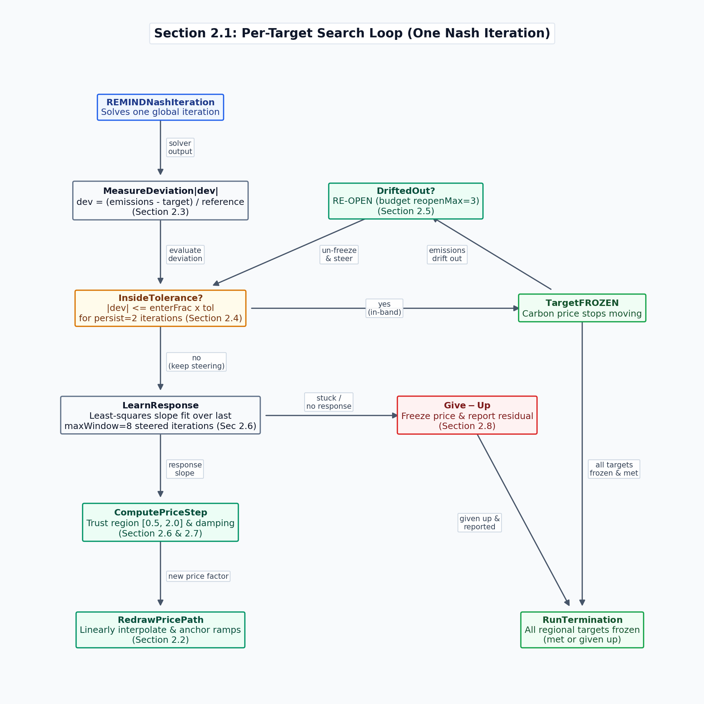
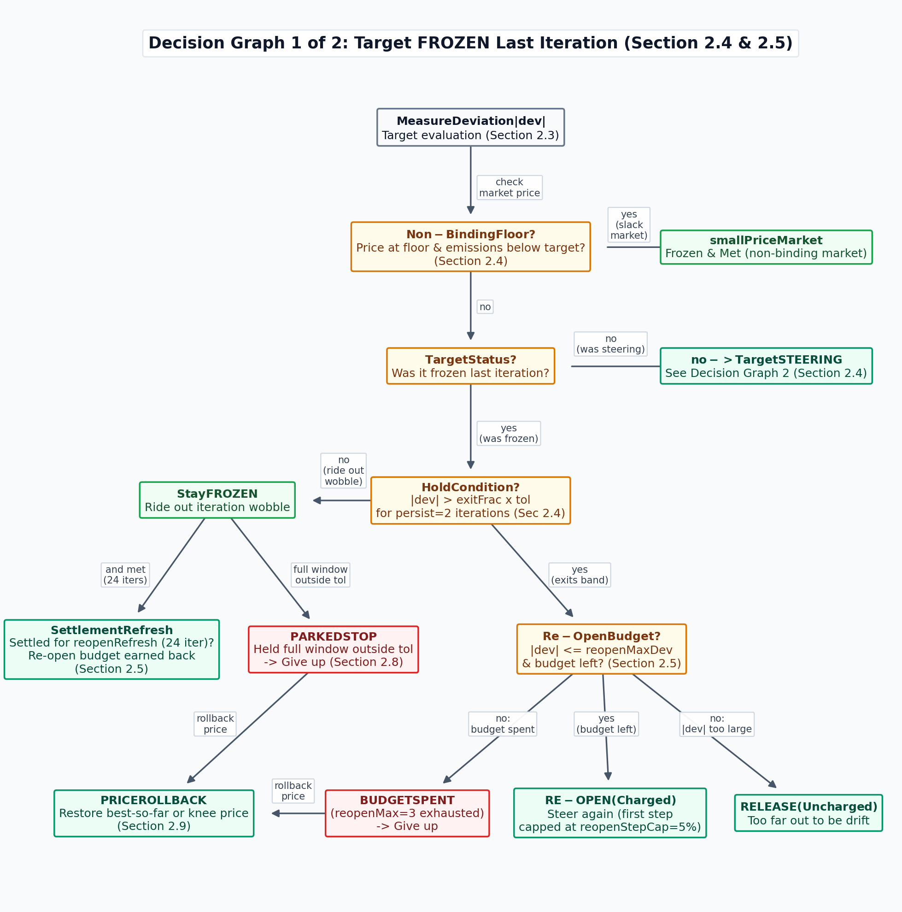
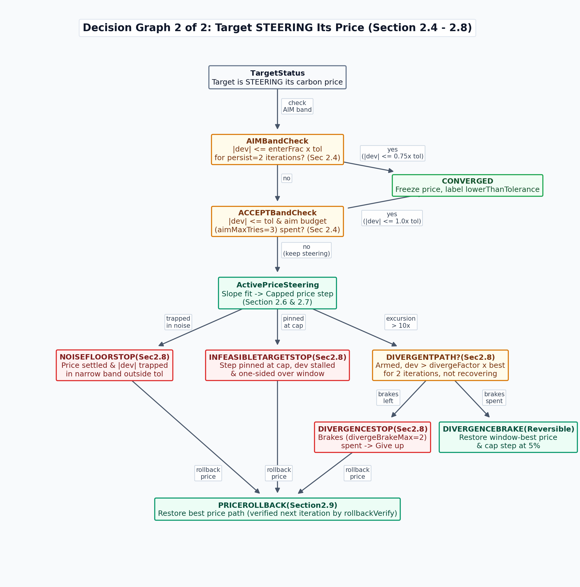

# Regional emission targets (module `47_regipol`, realization `regiCarbonPrice`)

This tutorial explains how to make REMIND hit a **regional emission target** (e.g. *"the EU must be at 2.2 GtCO2eq in 2030"*, *"Germany must be net zero in 2045"*) and documents the convergence search algorithm that computes the required carbon prices.

The code lives in `modules/47_regipol/regiCarbonPrice/`.

---

## Table of contents

- [1. User Guide](#1-user-guide)
  - [1.1 Quickstart: Using Regional Targets](#11-quickstart-using-regional-targets)
  - [1.2 Defining a Target: Full Syntax & Metrics](#12-defining-a-target-full-syntax--metrics)
  - [1.3 Setting Target Tolerances](#13-setting-target-tolerances)
  - [1.4 Verifying Run Outcomes & Reading Results](#14-verifying-run-outcomes--reading-results)
  - [1.5 Modeller Caveats & Rules of Thumb](#15-modeller-caveats--rules-of-thumb)
- [2. Algorithm Mechanics](#2-algorithm-mechanics)
  - [2.1 Conceptual Overview & Search Loop](#21-conceptual-overview--search-loop)
  - [2.2 Carbon Price Path & Ramp Anchoring](#22-carbon-price-path--ramp-anchoring)
  - [2.3 Deviation Normalization (Year vs. Budget)](#23-deviation-normalization-year-vs-budget)
  - [2.4 Convergence State Machine & Evaluation Bands](#24-convergence-state-machine--evaluation-bands)
  - [2.5 Re-Open Budget, Uncharged Release & Settlement Refresh](#25-re-open-budget-uncharged-release--settlement-refresh)
  - [2.6 Least-Squares Price Step Fitting & Fallbacks](#26-least-squares-price-step-fitting--fallbacks)
  - [2.7 Trust Region, Post-Reopen Cap & Progressive Damping](#27-trust-region-post-reopen-cap--progressive-damping)
  - [2.8 Giving Up: The Four Stop Mechanisms](#28-giving-up-the-four-stop-mechanisms)
  - [2.9 Price Rollback & Verify-and-Undo](#29-price-rollback--verify-and-undo)
  - [2.10 Outcome Classifications & Precedence](#210-outcome-classifications--precedence)
- [3. Developing, Diagnostics & Tuning](#3-developing-diagnostics--tuning)
  - [3.1 Diagnostic GDX Containers & Log Signals](#31-diagnostic-gdx-containers--log-signals)
  - [3.2 Settled Design Rules & Invariants](#32-settled-design-rules--invariants)
  - [3.3 Test Suite Harness & Config Sentinels](#33-test-suite-harness--config-sentinels)
  - [3.4 Related Switches in `47_regipol`](#34-related-switches-in-47_regipol)

---

## 1. User Guide

### 1.1 Quickstart: Using Regional Targets

REMIND does not know in advance which carbon price makes a region emit a specific target amount. You specify **what** the emissions should be, and REMIND **searches for the price**: after every Nash iteration, the model measures how far emissions are from the target, nudges the carbon price, and solves again. When emissions land inside the specified tolerance and remain there, the search freezes and the run can complete.

To enforce regional targets, set two switches in your `scenario_config*.csv` (or `main.gms`):

```gams
regipol             = regiCarbonPrice
cm_emiMktTarget     = 2020.2030.EU27_regi.all.year.netGHG_noLULUCF_noBunkers 3.16
```

**Syntax breakdown:**
* `2020`: Start year from which the carbon price path may be modified.
* `2030`: Target year (the period the emission limit applies to).
* `EU27_regi`: Region or region group (`DEU`, `EU27_regi`, `GLO`).
* `all`: Emission market (`all`, `ETS`, `ESR`, `other`).
* `year`: Target type (`year` for annual rate, `budget` for cumulative integration).
* `netGHG_noLULUCF_noBunkers`: Emission metric.
* `3.16`: Target value in $\text{GtCO}_2\text{eq}$ per year (or cumulative $\text{GtCO}_2\text{eq}$ for budget targets).

In words: *"Between 2020 and 2030, move the EU27 carbon price until EU27 net greenhouse gas emissions excluding land use and international transport are 3.16 GtCO2eq in 2030."*

#### Setting a Budget Target
```gams
cm_emiMktTarget = 2020.2050.EU27_regi.all.budget.netGHG_noBunkers 72
```
*"The EU27 may emit a total of 72 GtCO2eq cumulatively between 2020 and 2050."*

#### Setting Multiple Targets
Separate target definitions with commas. Targets for the same region are solved **sequentially** (earliest target year first):
```gams
cm_emiMktTarget = 2020.2030.EU27_regi.all.year.netGHG_LULUCFGrassi_intraRegBunker 2.221,
                  2035.2050.EU27_regi.all.year.netGHG_LULUCFGrassi 0.001,
                  2020.2045.DEU.all.year.netGHG_LULUCFGrassi 0.001
```
Preset net-zero targets for explicit REMIND countries can be loaded using `cm_implicitQttyTargetType = scenario` and `cm_emiMktTarget = nzero`.

---

### 1.2 Defining a Target: Full Syntax & Metrics

Full target definition format:
```gams
cm_emiMktTarget = <startYear>.<targetYear>.<region>.<market>.<type>.<metric> <value>
```

#### `<startYear>` and `<targetYear>`
* `targetYear`: The period the emission target applies to.
* `startYear`: The earliest period whose carbon price the algorithm is allowed to modify. For `budget` targets, `[startYear..targetYear]` also defines the cumulative trapezoidal integration window.

#### `<region>` & Precedence Rules
Any model region (`DEU`) or region group (`EU27_regi`, `GLO`).
* **Precedence:** If a region is covered by two targets at different aggregation levels (e.g. `DEU` and `EU27_regi`), the **more disaggregated target takes precedence** and controls the regional carbon price (resolved in `datainput.gms` into `regiEmiMktTarget2regi_47`).

#### `<market>`

| Value | Covers |
|---|---|
| `all` | ETS + ESR + other (the whole regional economy) |
| `ETS` | Emission Trading System sectors only |
| `ESR` | Effort Sharing Regulation sectors only (internally `ES`) |
| `other` | Everything not in ETS or ESR |

Prices in `other` are set equal to the `ESR` price whenever an `ESR` or `all` target exists.

#### `<metric>` (`emi_type_47`)
* `netCO2`, `netGHG`: All sectors including LULUCF and international bunkers.
* `*_noLULUCF`, `*_noBunkers`, `*_noLULUCF_noBunkers`: Standard sectoral exclusions.
* `*_LULUCFGrassi`: Land-use emissions shifted via `pm_emiLULUCF_GrassiShift` to match UNFCCC national accounting conventions rather than MAgPIE conventions.
* `*_intraRegBunker`: Retains 35% of bunker emissions (2000–2020 intra-EU average).
* `grossEnCO2_noBunkers`: Energy $\text{CO}_2$ before BECCS/DAC.

---

### 1.3 Setting Target Tolerances

Set target tolerance via `cm_emiMktTarget_tolerance` (fraction, default `GLO 0.01` = 1%):
```gams
cm_emiMktTarget_tolerance = GLO 0.01, DEU 0.004
```

> [!WARNING]<br>
> Baseline Nash iterations wobble by roughly $\pm 1\%$. Setting tolerances too low can cause the algorithm to hit noise floor artifacts.

---

### 1.4 Verifying Run Outcomes & Reading Results

Three complementary ways to check run results:

1. **Log Warnings (Fastest):** If a target cannot be reached within tolerance, REMIND prints a warning on every iteration:
   ```
   ### WARNING: region EU27_regi is CONVERGED but its emission targets are NOT MET.
   ###          unmet: 2020 2030 EU27_regi all  dev  0.02341  tolerance  0.01000
   ```
   *No warning means every target was met.*
2. **GDX Parameters:** Check `pm_emiMktTarget_dev_iter` (deviation per iteration, `0.01` = 1%) and `regiEmiMktconvergenceType` (outcome labels).
3. **HTML Report:** Run `Rscript output.R` and then select `nashConvergenceReport` to render a html report in your output folder with all information about the run convergence.

---

### 1.5 Modeller Caveats & Rules of Thumb

* Regional targets **override** the carbon price for target regions. Non-target regions retain global climate policy prices.
* Emission targets require `regipol = regiCarbonPrice`.
* For impossible targets (e.g. net-zero in 2030 for a coal-heavy region), REMIND will not crash. The algorithm will push the price up, notice that emissions stopped responding, freeze the price, and **report the residual**. Always read target deviations before interpreting scenario results.
* Scenario CSV configuration cells are limited to **254 characters** for GAMS switches (`cm_emiMktTarget` and `cm_slopeParam`).

---

## 2. Algorithm Mechanics

### 2.1 Conceptual Overview & Search Loop



On each Nash iteration, for each target:
1. **Measure:** Calculate relative distance from target (**deviation** $\text{dev}$).
2. **Learn Response:** Fit a least-squares line through recent (price, emission) pairs over the **last 8 steered iterations**.
3. **Compute Step:** Divide remaining gap by slope to get Newton step, and clamp step size within trust regions.
4. **Draw Price Ramp:** Apply new price to target year and linearly interpolate intermediate years.
5. **Check Convergence:** Freeze target price when deviation remains in-band for 2 consecutive iterations (`persist = 2`).

The run finishes when **all regional targets are frozen and either met or formally given up**.

---

### 2.2 Carbon Price Path & Ramp Anchoring

Controlled variable: `pm_taxemiMkt(ttot,regi,emiMkt)` in $\text{T}\$/\text{GtC}$ (multiply by $272$ for $\text{US}\$/\text{tCO}_2$).

* **Price Trajectory:** Target-year price is updated via multiplicative factor `pm_factorRescaleemiMktCO2Tax` (floored at $1\text{ US}\$/\text{tCO}_2$, capped by `maxPrice` if active). Ramps are linearly interpolated from the first free year ($\ge \text{startYear}, \ge \text{cm\_startyear}, \ge 2020$).
* **Post-Target Path:** After the final target year, prices increase by `cm_postTargetIncrease` $\text{US}\$/\text{tCO}_2$/year.
* **Ramp Anchoring:** Ramps of later target years start strictly after the **closest earlier target year of the same region**.

> [!NOTE]
> **Design Rationale: Target Ramp Anchoring**  
> Without anchoring, a later target's ramp draws from the pre-free year and overwrites earlier converged target years. In back-to-back targets (`2030 -> 2040`), unanchored ramps caused infinite limit cycles where 2030 was continuously wiped, re-ramped, and re-converged until the iteration cap.

---

### 2.3 Deviation Normalization (Year vs. Budget)

Target deviation `pm_emiMktTarget_dev` is expressed as a fraction (`0.01` = 1%).

#### Year Targets
$$\text{dev} = \frac{\text{Emissions}_{\text{targetYear}} - \text{Target}}{2005\text{ Emissions}}$$
*Normalizing by 2005 emissions keeps net-zero targets well-conditioned.*

#### Budget Targets
$$\text{dev} = \frac{\text{Cumulative Emissions} - \text{Target}}{\max\left(|\text{Target}|,\, \text{budgetDenomFloorFrac} \times \text{refBudget}\right)}$$
*`refBudget` (`p47_emiMktRefBudget`) is the cumulative emissions the market would produce at its 2005 annual rate over the same period.*

---

### 2.4 Convergence State Machine & Evaluation Bands

The per-target decision graph is divided into two halves based on whether the target was frozen last iteration:





#### Evaluation Bands

Evaluation bands are exact multiples of specified user tolerance `cm_emiMktTarget_tolerance`:

| Band | Switch / Parameter | Default | Function |
|---|---|---|---|
| **AIM** | `enterFrac` | `0.75` | Primary convergence threshold (75% of tolerance). Provides safety margin against Nash noise. |
| **ACCEPT** | `aimMaxTries` | `3` | Attempts inside 100% tolerance before accepting without reaching AIM band. |
| **EXIT** | `exitFrac` | `1.00` | Deviation threshold for breaking hold and re-opening target. |
| **Persistence** | `persist` | `2` | Consecutive iterations required to trigger any state change. |

The gap between **AIM** (`0.75`) and **EXIT** (`1.00`) creates **hysteresis** to prevent flip-flopping.

#### Non-Binding Market Floor (`smallPrice`)
If a constituent market price is at the floor ($\le 1.1\text{ US}\$/\text{tCO}_2$) and emissions are below target, the market is legitimately slack and frozen as **met**.

---

### 2.5 Re-Open Budget, Uncharged Release & Settlement Refresh

When a frozen target breaks its hold ($|\text{dev}| > \text{exitFrac} \times \text{tolerance}$ for `persist` consecutive iterations), three outcomes occur:

| Outcome | Condition | Action |
|---|---|---|
| **Re-Open (Charged)** | $|\text{dev}| \le \text{reopenMaxDev}$ and budget left | Un-freezes target, caps first step at $\pm 5\%$ (`reopenStepCap`), refreshes AIM attempt budget. Charged to `p47_targetState("reopenCount")`. |
| **Budget Spent** | $|\text{dev}| \le \text{reopenMaxDev}$, budget spent (`reopenCount = 3`) | Freeze target, set `p47_targetState("giveUp") = 1`, roll price back to best state. |
| **Uncharged Release** | $|\text{dev}| > \text{reopenMaxDev}$ | Released without charging `reopenCount` (counted in `releaseCount`). |

#### Settlement Refresh Rule
`reopenMax` (`3`) is a whole-run budget. If a target remains **frozen AND met AND not given up** for `reopenRefresh` (`24`) consecutive iterations (`settledCount`), its re-open budget resets to zero.

*Guards:* Refresh is disabled if `giveUp = 1` or `reopenRefresh < 1` (`1e-9` sentinel guard).

---

### 2.6 Least-Squares Price Step Fitting & Fallbacks

The least-squares fit window holds the last `maxWindow` (`8`) **steered iterations** (skipping frozen iterations).

#### The Five Fitting Cases (`regiEmiMktRescaleType`)

| Case | Name | Condition | Step Formula |
|---|---|---|---|
| 1 | `squareDev_firstIteration` | Single data point (cold start) | $(1 + \text{dev})^2$ |
| 2 | `squareDev_lowPriceSpread` | Price spread $< \text{minPriceSpread} \times P$ | $(1 + \text{dev})^2$ |
| 3 | `squareDev_unstableFit` | Wrong slope sign ($\ge 0$) or $R^2 < \text{minR2}$ | $(1 + \text{dev})^2$ |
| 4 | `squareDev_degenerateSlope` | Emission response $< \text{degenerateThreshold}$ | $(1 + \text{dev})^2$ |
| 5 | `slope` | Valid Newton fit | $\text{factor} = \frac{\text{Target} - \text{Current}}{\text{Slope} \times P} + 1$ |

In case 5, slope magnitude is clamped by `maxSteep` ($5.0$).

#### Fallback Step Bound
Fallback steps (`squareDev`) are bounded by `fallbackStepFactor` ($2.0$) $\times$ the **mean** $|\text{rescale} - 1|$ applied over the window, floored at `fallbackStepFloor` ($0.05$). Using the mean prevents step-size ratcheting.

---

### 2.7 Trust Region, Post-Reopen Cap & Progressive Damping

* **Trust Region:** All price steps clamped to $[0.5, 2.0]$ (`rescaleCapLo`, `rescaleCapHi`).
* **Post-Reopen Cap:** The first step following a re-open is capped at $\pm 5\%$ (`reopenStepCap`).
* **Progressive Oscillation Damping:** Reversals across 1 in the fit window scale steps down by $\text{dampProgFactor}^{(\text{nFlip} - \text{dampFlipMin} + 1)}$ (floored at `dampFloor = 0.1`).

---

### 2.8 Giving Up: The Four Stop Mechanisms

All four stops set `p47_targetState("giveUp") = 1`, freeze the price, and report a residual:

1. **Noise-Floor Stop (Tier 3):** $|\text{dev}| \le \text{noiseFloorMaxDev}$, price settled, and deviation trapped in a band narrower than $\max(\text{noiseFloorBandWidth}, \text{noiseFloorBandWidthRel} \times \text{tolerance})$. Freezes at window-local best (`noiseFloorRollback`). Gated on $|\text{dev}| > \text{tolerance}$.
2. **Infeasible-Target Stop:** $|\text{dev}| > \text{noiseFloorMaxDev}$, rescale pinned at cap ($2.0$), deviation stalled ($\ge \text{infeasStallFrac} = 0.9$ of window max), and deviation one-sided over window. Freezes and rolls price back to earliest "knee".
3. **Divergence Handling:** Target armed ($\le 1.0\times$ tolerance while steering), persistent excursion ($> 10\times \max(\text{bestDev}, \text{tolerance})$ for 2 iterations), and not recovering. Takes up to `divergeBrakeMax = 2` step-capped brakes before freezing.
4. **Parked-Target Stop:** Catches targets held frozen by hysteresis while sitting outside raw tolerance (`parkedStop = 1`).
5. **Optional Price Ceiling:** `maxPrice` (default 0 = off) caps target-year prices in $\text{US}\$/\text{tCO}_2$, forcing unreachable targets into the infeasible stop early.

---

### 2.9 Price Rollback & Verify-and-Undo

When a give-up stop fires, the algorithm selects the best price path:
* **Candidate:** Run-wide best iteration (`p47_targetState("bestDevAbs")`) vs. stop candidate (knee / window best).
* **Selection:** Prefers run-wide best if meaningfully better ($\le \text{rollbackBestFrac} \times |\text{dev}_{\text{now}}|$ = 2x better) and recent ($\le \text{rollbackMaxAge} = 8$ iterations).
* **Verify & Undo:** Checks deviation on the very next iteration. If deviation worsens, `rollbackVerify` **undoes** the rollback and restores the pre-rollback price path (`p47_targetState("rolledBack") = 2`).

---

### 2.10 Outcome Classifications & Precedence

Verdicts saved in `regiEmiMktconvergenceType`:

$$\text{unmetAtCap} > \text{unmetFrozen} > \text{bestAchievable} > \text{lowerThanTolerance} \quad (\text{smallPrice is exclusive})$$

* **Promotion Pass:** Ensures give-up stops landing inside tolerance are labeled `lowerThanTolerance`.
* **Demotion Pass:** Re-labels frozen targets outside exit band as `unmetFrozen` (or `unmetAtCap` at iteration cap).

---

## 3. Developing, Diagnostics & Tuning

### 3.1 Diagnostic GDX Containers & Log Signals

All persistent state and diagnostics are stored in three set-indexed containers in `fulldata.gdx`:

* `p47_slopeParam(slopeParam)`: Configuration constants (element texts documented in `sets.gms`).
* `p47_targetState(targetState, ttot, ttot2, ext_regi, emiMktExt)`: Persistent state machine variables (`giveUp`, `aimTries`, `reopenCount`, `divArmed`, `rolledBack`, `bestDevAbs`).
* `p47_slopeTrace_iter(slopeTrace, iteration, ttot, ttot2, ext_regi, emiMktExt)`: Iteration events (`rawSlope`, `fitR2`, `preDamp`, `rollIter`, `divBrake`, `parked`).

```bash
# Dump state machine dictionary and final verdicts
gdxdump fulldata.gdx symb=targetState format=csv
gdxdump fulldata.gdx symb=regiEmiMktconvergenceType format=csv
```

#### Key Log Messages

| Log String | Meaning |
|---|---|
| `Progressive oscillation dampening (N reversals)` | Step scaled down due to overshoots |
| `Best-achievable freeze: price rolled back to iteration N` | Give-up stop executed rollback |
| `Rollback UNDONE (deviation got worse)` | Rollback verification failed; pre-rollback state restored |
| `Divergence BRAKE (n of m)` | Reversible divergence brake applied (step capped at 5%) |
| `Re-open budget refreshed after N settled iterations` | Budget restored after sustained settlement |

---

### 3.2 Settled Design Rules & Tests

1. **Raw Tolerance Yardstick:** Measure all state transitions against raw tolerance. Never widen tolerance dynamically based on oscillation.
2. **Decoupled Mechanisms:** Never gate two mechanisms on one knob (keep `noiseFloorMaxDev` and `parkedStop` separate).
3. **Scenario Test Suite:** `config/scenario_config_emiMkt_tests.csv` paired with off-arms (`cm_slopeParam = '<knob> 1e-9'`).

---
