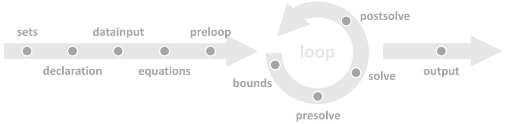

Start running REMIND with default settings
================
Felix Schreyer (<felix.schreyeru@pik-potsdam.de>), Lavinia Baumstark (<baumstark@pik-potsdam.de>), David Klein (<dklein@pik-potsdam.de>)
30 April, 2019

-   [1. Your first run](#1-your-first-run)
    -   [Default configurations](#default-configurations)
    -   [Accessing the cluster](#accessing-the-cluster)
    -   [Adjust the Rprofile](#adjust-the-rprofile)
    -   [Starting the run](#starting-the-run)
    -   [Restarting runs](#restarting-runs)
-   [2. What happens during a REMIND run?](#2-what-happens-during-a-remind-run)
-   [3. What happens once you start REMIND on the cluster? ](#3-what-happens-once-you-start-remind-on-the-cluster)
    -   [a) Input data preparation](#a-input-data-preparation)
    -   [b) Optimization](#b-optimization)
    -   [c) Output processing](#c-output-processing)


# 1. Your first run

This section will explain how you start your first REMIND run on PIK's cluster (starting REMIND on other machines is theoretically possible but works slightly different depending on input data availability and operating system configuration).

## Default Configurations

The [`config/default.cfg`](../config/default.cfg) file contains the default configuration for REMIND.
It is divided into four parts: MODULES, SWITCHES, FLAGS, and Explanations of switches and flags.

a. The first part, MODULES, contains settings for the various [modules](../modules) and their realizations. For example, the [module `21_tax`](../modules/21_tax/) has the realizations [`on`](../modules/21_tax/on) and [`off`](../modules/21_tax/off). The realizations within the particular module differ from each other in their features, for e.g., bounds, parametric values, different policy cases etc. For each module you choose which realization of the module will be activated for your current run:

``` bash
cfg$gms$module_name
```

b. The SWITCHES and FLAGS section contain settings to control, for e.g., how many iterations to run, which technologies to include, which SSP to use, start and end year of model run etc. See the fourth section, explanations of switches and flags, to learn more.

## Accessing the cluster

As normal runs with REMIND take quite a while (from a couple of hours to several days), you normally don't want to run them locally (i.e., on your own machine) but on the cluster provided by the IT-services. The first step is to access the cluster. In general, there are three ways how to access the cluster:

1. The main tool to work on the cluster is the console. This is provided by PuTTY (for most Windows users) or simply a terminal (other operating systems)
2. WinSCP allows you to access files and do file operations 
3. Windows Explorer, click on network drive (only possible if you are in PIK LAN), same as WinSCP

They all have their upsides and downsides. Don't worry! If they are new to you, you will figure out what is best for which kind of task after some time and get more familiar just by your practice. Using either the console or the network drive in Windows Explorer, the first step is:

## Adjust the .profile

First, log onto the cluster via WinSCP and open the file `/home/username/.profile` in a text editor. Add these two lines and save the file.

``` bash
module load piam
umask 0002
```
The first line loads the `piam` environment once you log onto the cluster via console the next time. This environment will enable you to manage the runs that you do on the cluster. The second line makes sure the files you create on the cluster will be writable by your coworkers. Next, you need to specify the kind of run you would like to do.

## Starting the run

Open a console session on the cluster and create a folder on the cluster where you want to store REMIND. It is recommended not to use the `home` directory. For your first experiments you can use a subfolder of the `/p/tmp/YourPIKName/` directory (only stored for 3 months).

In case you are using console and are not familiar with shell commands, google a list of basic shell commands such as `mkdir` to create a folder or `cd /p/tmp/YourPIKName/` to switch to your folder. Download REMIND into a directory in this folder via `git clone` (see tutorial [0_Git_and_GitHub_workflow](0_Git_and_GitHub_workflow.md)).

Go to your REMIND main folder (i.e. it contains subfolders such as `config`, `core`, and `modules`) and start a REMIND run by typing:

``` bash
Rscript start.R
```
Without additional arguments this starts a single REMIND runs using the settings from [`config/default.cfg`](../config/default.cfg). Also, on Windows, you can double-click the `start.cmd` file. NOTE: In order to use those scripts on local machines, you have to have R installed on your machine. Don't forget to update the R libraries from time to time (explained in the Wiki page above, you need to do it only on local machines, on the cluster it happens automatically).

You can control the script's behavior by providing additional arguments, for example starting a single REMIND run in one-region mode using the settings from `config/default.cfg` (useful to quickly check if your changes to the code break the model):

``` bash
Rscript start.R --quick
```
The shortcut is
```bash
Rscript start.R -q
```


A message similar to the following confirms that your runs has been submitted to the cluster: `Submitted batch job 15489230`.

You can check if the run has been accepted by the cluster just by using the command

``` bash
sq
```
in the terminal.

To see how far your run is or whether it was stopped due to some problems, go to the `output` folder and type

``` bash
rs2
```
in the console. For more commands to manage your runs, type **piaminfo**.

NOTE: A few words on the scripts that we currently use to start runs. The scripts containing the string 'start' have a double functionality:
- they submit the run to the cluster or to your GAMS system if you work locally
- they create the `full.gms` file (this is the file that will eventually be submitted to GAMS once your run has been compiled) and compile the needed files to start a run in a subfolder of the output folder

## Restarting runs

Sometimes you want to restart a run in its already existing results folder without creating a new results folder and without compiling a new full.gms., e.g. you want a nash run to perform additional nash iterations because you are not satisfied with the convergence so far. Adding the parameter `--restart` displays a list of existing runs and lets you choose the run(s) you want to restart:

``` bash
Rscript start.R --restart
Rscript start.R -r
```

This will use the result of the previous optimization (`fulldata.gdx`) as input for the restart. Note that this will NOT continue the run from the last CONOPT iteration (which is impossible at the moment), but simply restart the run from the last `fulldata.gdx`. Accordingly, all outputs (like `full.lst`, gdx, etc) are overwritten if you do not first make a copy by hand.


# 2. What happens during a REMIND run?

This section will give some technical introduction into what happens after you have started a run. It will not be a tutorial, but rather an explanation of the different parts in the modeling routine. The whole routine is illustrated in Figure 1. The core of the model is the optimization written in GAMS. However, there is some pre-processing of the input data and some post-processing of the output data using R scripts.


<p class="caption">
REMIND modeling routine
</p>

# 3. What happens once you start REMIND on the cluster?

First, a number of R libraries like **madrat**, **mrremind** and **remind** are loaded into your cache on the cluster. These libraries were and are still developed at PIK. They contain the functions necessary for the input data preparation and the output processing. Let us go through each of the stages and briefly describe what happens:

## a) Input Data Preparation

The optimization in REMIND requires a lot of input data. For example, the model needs to know energy production capacities per region for its initial time steps. Furthermore, it builds on GDP, population and energy demand projections that are results of other models. These kind of data are stored on the cluster in

``` bash
/p/projects/rd3mod/inputdata/sources
```

The data are mostly in csv files. During the input data preparation, these files are read and processed, using functions from the *mrremind* package. Input data are available on country-level. Then, depending on the regionmapping file you chose in the config file of your run, the country-level data are aggregated into regions, e.g. to LAM (Latin America), EUR (Europe) and so on. Finally, the data are stored as .cs3r or .cs4r files in various input folders of your REMIND directory. These files are basically tables, too, that you can open with a text editor or Excel. For example, you find the input file `pm_histCap.cs3r` in your REMIND directory under `core/input`. It provides the model with historically observed values of installed capacities of some technologies in the respective regions.
The regional resolution of the run is set in the `config/default.cfg` by
``` bash
cfg$regionmapping
```
(default setting: regionmapping <- "config/regionmappingH12.csv"). Based on the regional resolution and the input data revision
``` bash
cfg$inputRevision
```
the name of the needed input data is constructed. It is checked whether those input data are already available. If not they are automatically downloaded from `/p/projects/rd3mod/inputdata/output/` and distributed.

## b) Optimization

The actual REMIND is written in GAMS, a programming software to numerically solve optimization problems. The GAMS scripts are *.gms* files that you can find under the `core` (main part of the model) and the `modules` directories (subparts of the model). The general structure of the GAMS code is depicted in Figure 2. At each stage (e.g. *sets*), GAMS runs through the respective *.gms* files of the core and all chosen module realisations of that stage (`core/sets.gms` -> `modules/01_macro/sets.gms`, -> `modules/02_welfare/sets.gms` -> ...) before going to the next stage. The stages *bounds*, *presolve*, *solve* and *postsolve* are run in a loop that is followed by the final stage *output*.


<p class="caption">
GAMS code structure
</p>

Fundamentally, we distinguish between two kinds of variables: variables (starting with *v_*) and parameters (starting with *p_*). Parameters are fixed (exogenous data in economists' lingo), while variables are free within a certain range and can be adjusted to maximize the objective function of the optimization problem (endogenous variables in economist's lingo). However, there are many constraints that fix relations between the variables and parameters. Within the remaining solution space, the optimization procedure tries to find the maximum of the objective function. The output file of the optimization is the **fulldata.gdx** which is under `output` in the folder of your REMIND run. You can open it, for instance, with GAMS IDE or load it into `R` using the command  `readGDX()` (see details below). In the file, you can find, among other things, the optimal levels of the variables (`variable.l`) and all the predefined parameter values.

## c) Output Processing

The output processing works with a number of R functions from the **[remind2](https://github.com/pik-piam/remind2/)** package (most of them start with `report... .R`). The wrapper function **[convGDX2MIF.R](https://github.com/pik-piam/remind2/blob/master/R/convGDX2MIF.R)** writes the most relevant output into the so-called **.mif** file. Again, it is a table that you can open in Excel for example. You find under `output` in the folder of your REMIND run as

``` bash
REMIND_generic_YourRun.mif
```
where *YourRun* is the name of the run you specified in the first column of the config file. It is important to keep in mind that between `fulldata.gdx` and the `.mif` file and number of calculations and conversions are happening which makes the variables in both files different. For output analysis, the `.mif` file is often more helpful, while in case you want to trace back some problem with the GAMS optimization, it can be necessary to directly look at optimal levels, marginals (values that tell you whether a variation of the variable increase or decrease the welfare level) or bounds (maximum and minimum value allowed for variable) that you all find in the `fulldata.gdx` created right after the optimization.
