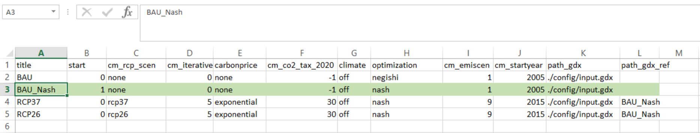
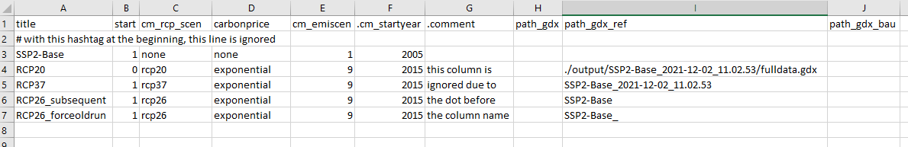

Running more than one REMIND scenario
================
Oliver Richters, 10 January, 2022

The folder **[config](../config)** in your REMIND folder contains a number of csv files that start with **scenario_config**. Those files are used to start a bundle of runs each with different configurations.

You can start such a bundle of REMIND runs using the settings from a `scenario_config_XYZ.csv` with:

``` bash
Rscript start.R config/scenario_config_XYZ.csv
```

The scenario_config files are csv files using `;` as their delimiter. They can be edited with a text editor, or opened with a spreadsheet software (Excel, LibreOffice Calc). Viewed as a spreadsheet, the first row contains the column titles, while subsequent rows each contain a different remind run.

In Excel, you might need to select the first column, choose *Data* and *Text to Columns* and set the right delimiter `;` to see the csv-file spread over the columns. Save the config file as a csv file with `;` as delimiter. You can check that, for example, by opening the csv in a text editor. If the delimiter is not `;`, change it in Windows under ***Control Panel*** ->  ***Region***  -> ***Additional Settings*** -> ***List separator***.


<p class="caption">
Example for a scenario_config of REMIND
</p>

Those two columns are mandatory and usually placed at the beginning:

* `title` labels that run. It contains a unique identifier for each run, which must not contain a `.` and must not end with a `_`. The more runs you will have, the more it will be important that you label them in a way such that you easily remember the specific settings you chose for this run.
* `start` is a boolean switch that lets you choose whether or not you would like to start this run once you submit this config file to the modeling routine. It often makes sense to keep some runs in the csv file to remember their configurations for the next time although you do not want to run them now and therefore switch them off. You do this by setting `start` to 0.

Further columns are the configurations that you can choose for the specific runs.
They may contain values for parameters such as `cm_rcp_scen` and module realizations such as `exponential` for [`./module/carbonprice/`](../modules/45_carbonprice). They overwrite the default defined and explained in [`./config/default.cfg`](../config/default.cfg) by the respective cell value for each run. If you leave a cell empty or if no column exists for a setting, the default value is used.

An important feature of scenario_config files is the possibility to execute runs which build on each other.
Examples are (1) using the base run for all time steps until `cm_startyear`, or (2) use it to compare the impact of certain policies to a situation without them.
Such a “subsequent run“ has to wait until its “base run“ is finished, and then will be started automatically using the data from the base run.

Important: Do not make changes to the REMIND code until the last run has started running GAMS (including subsequent runs). Don't `git checkout` other branches or manually edit REMIND files.


<p class="caption">
Example with comments and different ways to specify subsequent runs.
</p>

The columns to implement subsequent runs are usually found at the end, starting with `path_gdx`:

* `path_gdx` allows to specify initial conditions for the run, overwriting the usual initial conditions taken from the calibration files found in [`./config/gdx-files/`](../config/gdx-files/files). If it points to an unconverged run, this can be used to restart runs, similar to `Rscript start.R --restart`.
* `path_gdx_bau` points to the run used as business as usual (BAU) scenario, for example for runs using [`45_carbonprice/NDC`](../modules/45_carbonprice/NDC), where some countries specify emission as percentage reduction compared to BAU.
* `path_gdx_carbonprice` can be used to use a carbon tax path from an earlier run with realization [`45_carbonprice/exogenous`](../modules/45_carbonprice/exogenous).
* `path_gdx_ref` points to the run used for all `t < cm_startyear`, which can be used for example for delayed transition scenarios.
* `path_gdx_refpolicycost` points to the run that is used as a comparison for the policy cost calculation. If no such column exists, `path_gdx_ref` is used instead.

These columns starting with `path…` can point to either finished runs or other rows of the current model execution:
* provide a path to an existing `gdx` file such as `./output/SSP2-Base_2021-12-24_19.30.00/fulldata.gdx`. For subfolders of `./output/`, writing the folder name `SSP2-Base_2021-12-24_19.30.00` is sufficient.
* provide the entry of a `title` of another row, such as `SSP2-Base`.
  * If the run with this `title` is set to `start = 1`, then runs that point to this `title` are turned into “subsequent runs“ that will be started after the linked one is finished. Note that in this case, the REMIND code must not change until the `full.gms` file of the last subsequent run was generated.
  * If the run with this `title` is set to `start = 0` or does not exist in the `scenario_config_XYZ.csv` file, the function `configure_cfg` of [`start.R`](../start.R) searches in `./output` for folder with that title which contain a `fulldata.gdx` and whose `full.log` states `*** Status: Normal completion`, and then picks the one with the latest date and time in the folder name. Appending a `_` to a `path_gdx…` entry forces REMIND to always take a `fulldata.gdx` from an earlier run. So if you have a row with `title` `BAU_Nash` and you add `BAU_Nash_` to the `path_gdx` column, REMIND always uses an earlier run with the same name as initial condition, speeding up convergence.
  * If no run is found, the script also looks in `cfg$modeltests_folder` and so if you use a title of a scenario from the automated model tests in [`scenario_config_AMT.csv`](../config/scenario_config_AMT.csv), the most recent of these run is picked which is useful for testing purposes.

The image above shows these possibilities used for `path_gdx_ref`. Run `RCP20` has a complete path specified but will not be executed because `start = 0`. `RCP37` provides a complete folder name and therefore starts immediately using the `fulldata.gdx` from this folder, `RCP26_subsequent` waits for `SSP2-Base` to be finished, and `RCP26_forceoldrun` selects the latest already finished `SSP2-Base` run in the output folder and starts immediately. If you set `start = 0` also for `SSP2-Base`, then `RCP26_subsequent` will also try to find an old run in a folder that looks like `SSP2-Base_YYYY-MM-DD_HH.MM.SS`. Note that the fact that “subsequent“ is part of the `title` is only to ease the understanding, you can name these runs however you want.

The column `slurmConfig` can be used to specify the slurm configuration, either as a string or as an integer that selects the corresponding mode from [`choose_slurmConfig.R`](../scripts/start/choose_slurmConfig.R).

Everything in the row after a `#` is interpreted as comment. Best use it as first character in the first column to structure the file. Using `#` elsewhere else can lead to unexpected data losses of the cells that follow in the row. If you want to switch off the use of a column, either temporarily or to add some comments, add a dot before the parameter name, which then may read `.cm_startyear` and is then ignored.

Before you start the runs, you can test whether the right runs would be started and find all necessary gdx files. This also writes the `.Rdata` files in the REMIND main folder:
```bash
Rscript start.R --test config/scenario_config_XYZ.csv
```
Running the complete chain of runs, but only for one region and one iteration, can be started with:
```bash
Rscript start.R --quick config/scenario_config_XYZ.csv
```
If you want to manually start runs instead of editing the `start` column in the config file, start:
```bash
Rscript start.R --interactive config/scenario_config_XYZ.csv
```
In interactive mode, the scripts lets you select a config files if you do not specify one. You can combine all these options and use
```bash
Rscript start.R -qit
```
as a shortcut, meaning `q` for `--quick`, `i` for `--interactive`, `t` for `--test`.


Further notes:
--------------

* The cells need not contain only a single value, but for example module realization [`47_regipol/regiCarbonPrice`](../modules/47_regipol/regiCarbonPrice) allows to specify in the parameter `cm_regiCO2target` to enter comma separated values `2020.2050.USA.year.netGHG 1, 2020.2050.EUR.year.netGHG 1` to specify emission goals for multiple regions.

* To compare a `scenario_config*.csv` file to the current default configuration, you can run `Rscript -e "remind2::colorScenConf()"` in your REMIND directory and select the file you are interested in. [`colorScenConf()`](https://github.com/pik-piam/remind2/blob/master/R/colorScenConf.R) produces a file ending with `_colorful.xlsx` in the same directory and provides you with information how to interpret the colors within.

* To compare two `scenario_config*.csv` files, for example after a change, run `Rscript -e "remind2::compareScenConf()"` in your REMIND directory to get a human-readable list of changes with further options [offered in the function description](https://github.com/pik-piam/remind2/blob/master/R/compareScenConf.R), or try these git commands:

        git diffmif scenario_config_1.csv scenario_config_2.csv
        git diff --word-diff=color --word-diff-regex=. --no-index scenario_config_1.csv scenario_config_2.csv
