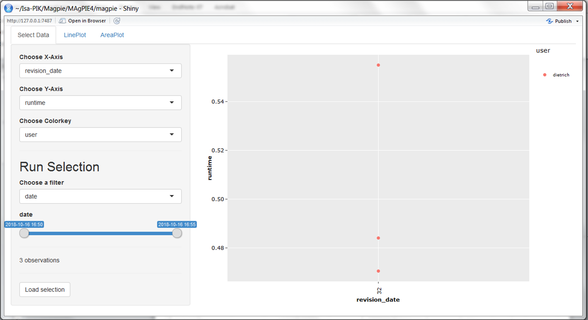
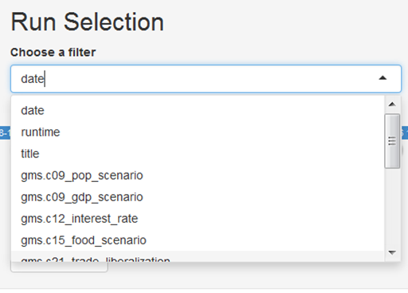
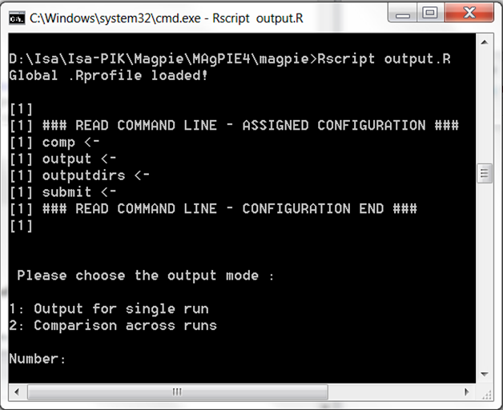

Analyzing REMIND model outputs
================
Felix Scheyer (<felix.schreyer@pik-potsdam.de>), Isabelle Weindl (<weindl@pik-potsdam.de>), Lavinia Baumstark (<baumstark@pik-potsdam.de>)

-   [1. Introduction](#introduction)
-   [2. Model output files](#model-output-files)
-   [3. Loading and analyzing model output in R](#loading-and-analyzing-model-output-in-r)
    - [3.1 Access Cluster](###Access-Cluster)
    - [3.2 Load mif-file as Magpie Object](#load-mif-file-as-magpie-object)
    - [3.3 Load mif file as quitte Object](#load-mif-file-as-quitte object)
    - [3.4 Load gdx file as magpie object](#load-gdx-file-as-magpie-object)
-   [4. Automated model validation](#automated-model-validation)
    -   [4.1. Generation of validation pdfs](#generation-of-validation-pdfs)
    -   [4.2 A Summary of Results](#summary-of-results)
    -   [4.3 The Whole Range of Validation](#whole-range-of-validation)
-   [5. Interactive scenario analysis](#interactive-scenario-analysis)
    -   [5.1. AppResults](#appResults)
-   [6. Model-internal R-scripts for output analysis](#model-internal-r-scripts-for-output-analysis)
    -   [6.1. Execution of model-internal output scripts via the REMIND configuration file](#execution-of-model-internal-output-scripts-via-the-remind-configuration-file)
    -   [6.2. Execution of model-internal output scripts in the command window](#execution-of-model-internal-output-scripts-in-the-command-window)

1. Introduction
===============

After having successfully started and completed a scenario run, the next step is to evaluate the results. 

There are plentiful ways to look at and analyze REMIND results. This tutorial gives an overview on different tools and options that can be used.

For each scenario, results are written to a folder that is created automatically as a combination of **scenario title** name and the **current date** inside the **output** folder of the model.

2. Model output files
=====================

As mentioned in tutorial 2, the two main output files you will typically care about are the *fulldata.gdx* and the *REMIND_generic_NameofYourRun.mif* files in the *output* folder of your run. The *fulldata.gdx* is the actual technical output of the GAMS optimization and contains all the variables, parameters, sets etc. (the differences between these GAMS objects are explained in tutorial 2) of the REMIND model. However, this gdx-file is mainly interesting once you actually work on the GAMS code and want to check specific the variables and their values. If you simply want to look at REMIND results of your run or use it for further data analysis and plotting, you would open the *REMIND_generic_NameofYourRun.mif* which is basically a csv-file in a certain standardized format (called the model intercomparison file format) used in the Integrated Assessment Modeling community. Please refer to the `vignette("mif")` of the package *mip* (model intercomparison plots) to learn more about the mif format.

Looking at the *REMIND_generic_NameofYourRun.mif*, the column **scenario** gives the name of the run (that you specified in the first column of your config file when starting the run). The column **region** provides an three-letter acronym of the region (e.g. EUR -> EU, SSA -> Sub-Saharan Africa). The column **variable** represents the variable you are looking at (To avoid confusion with the above: It does not necessarily represent a variable in the GAMS code of REMIND. The mif-file is a synthetized output generated from *fulldata.gdx* by post-processing Rscripts from the *remind* package). Scrolling through the **variable** column, you will get an impression of the outputs the REMIND model permits you to explore. 

3. Loading and analyzing model output in R
==============================

### 3.1 Access the Cluster

To analyze your model results, you can load the output of the mif-file into a local session in RStudio. To get the file from the cluster, you can download the mif-file, for example, via WinSCP. You can read more details on how to access the cluster here:


https://redmine.pik-potsdam.de/projects/mo/wiki/Getting_ready_to_use_the_Cluster


### 3.2 Load a mif file as a Magpie Object

You can load the mif-file of your run into a magpie object from the **magclass** R package by

``` r
out <- read.report("Path/to/your/mif-file", as.list = F)
```
This will load the content of the mif-file into a magpie object which is an array that we specifically use to handle inputs and outputs of REMIND and MagPIE. By

``` r
str(out)
```
you see the dimension of the magpie object. Magpie objects are basically arrays, you can look at specific entries, for example, like this 

``` r
out["EUR", c("y2020","y2050"), "FE|Transport (EJ/yr)"]
```
Instead of these objects from the R package **magclass**, you can also use data frames from the R package **quitte**. Arrays are generally better for doing calculations, while data frames are better for plotting. You will find out after a while which way works best for you. The **quitte** data frames are probably better for output analysis because this is a lot about plotting. For reading in the *.mif* file as a data frame, you have to load the package **quitte** and then run the command

### 3.3 Load a mif file as a quitte Object	

``` r
mifdata <- read.quitte('PathtoYourMifFile.mif')
```
The data is now stored in the *quitte* object *mifdata*. In RStudio, selecting it (the text *mifdata* in the editor window) and hitting F2 will show you its content. Usually, you will want to filter for some regions, variables, periods that you are interested in. For example, like this: 
	
``` r
df <- filter(mifdata,
   		region %in% c('EUR','LAM'),
			variable %in% c('SE|Electricity'),
			scenario %in% c('BAU'),
			period %in% c(2005,2030,2050)) 
```
### 3.4 Load a gdx file as a Magpie Object

Finally, you can also load the content of the **fulldata.gdx** via the function **readGDX** of the **gdx** package  (<https://github.com/pik-piam/gdx>) into a magpie file to directly access the GAMS output. Here is an example of how **readGDX** is used:

``` r
pe2se  <- readGDX(gdx,"pe2se")
Mport  <- readGDX(gdx,c("vm_Mport"),field="l",format="first_found")
demPE  <- readGDX(gdx,name=c("vm_demPe","v_pedem"),field="l",restore_zeros=FALSE,format="first_found")
```
Here **gdx** is the path to the gdx file, while the second argument is the **name** of the GAMS object you want to load. It is possible to extract various GAMS objects like *"sets"*, *"equations"*, *"parameters"*, *"variables"* and *"aliases"* with **readGDX**. With the arguemtn *field="l"*, you can select the levels of endogenous variables. With *field="m"* you can extract the marginal values of these variables.

**To learn how to produce nice graphs from the model output you read in above please refer to [8_Advanced_AnalysingModelOutputs](./8_Advanced_AnalysingModelOutputs.Rmd)**

---

**In the following, we present several other tools and scripts that were developed to facilitate the output analysis:**


4. Automated model validation
===============================

### 4.1. Generation of summary and validation pdfs
The automated model analysis (summary and validation) is an important example of output analysis based on model-internal scripts (see section 6). If these scripts are executed (either by selection via cfg$output as explained in 6.1. or by execution via command window as explained in 6.2.), standard evaluation pdfs are created. They validate numerous model outputs with historical data, either visually or via statistical tests. 

### 4.2 A Summary of Results
For a first overview and for not getting lost in the huge amount of variables you can look at the *REMIND_summary_[title].pdf*. This .pdf-file will give you an overview on the model results and guides you through the story. 

### 4.3 The Whole Range of Validation
A standard validation PDF *REMIND_validation_[title].pdf* consists of hundreds of evaluation outputs. By evaluating the model outputs on such a broad level rather than focusing only on key outputs, it allows getting a more complete picture of the corresponding scenario. The table of contents of the validation pdf gives a good overview about the breadth of model outputs that can be generated with a REMIND standard scenario, even though the validation pdf only shows a subset of possible model outputs.


5. Interactive scenario analysis
==================================

The automated model validation is a good tool for visually evaluating a broad range of model outputs. However, comparison between model runs, i.e. between different scenarios, is rather difficult and inconvenient if the model results are scattered across different large PDF files.

### 5.1. AppResults

To overcome this issue, we developed the interactive scenario analysis and evaluation tools appResults and appResultsLocal as part of the package **shinyresults** (<https://github.com/pik-piam/shinyresults>), which show evaluation plots for multiple scenarios including historical data and other projections based on an interactive selection of regions and variables. You can use this tool by running the following R command, which will automatically collect all runs and visualize them:

``` r
shinyresults::appResults()
```

This command opens an interactive window, where you can select the scenarios that you want to evaluate.



<p class="caption">
Interactive Results app
</p>

You can use filters to select a subset of all runs stored in the output folder of the model, for example by searching for runs that have been finished at a certain day or by searching for keywords in the title of the scenarios:


<p class="caption">
Run selection by using a filter
</p>

If you run the following command in the output folder of your local computer you get an interactive window containing the results of this output folder:
``` r
shinyresults::appResultsLocal()
```
Another tool for analyzing model output on your local computer is the scenario tool from the mip package. You can open it from the R console by: 

``` r
mip::scenTool()
```

6. Model-internal R-scripts for output analysis
=================================================

### 6.1. Execution of model-internal output scripts via the REMIND configuration file

In the file *config/default.cfg*, it is possible to indicate which R-scripts are executed for output analysis after a model run is finished. Scripts evaluating single runs are stored in the folder **scripts/output/[title-of-the-run]**. In the default REMIND configuration, the scripts *reporting*, *validation* (see section 2.3), *validationSummary*  (see section 2.3), *rds\_report* (to be used in appResults; see section 3), and *dashboard* are selected via cfg$output:

``` r
cfg$output <- c("reporting","validation","rds_report","validationSummary","dashboard")
```

### 6.2. Execution of model-internal output scripts in the command window

Output scripts that are included in the folders **scripts/output/single** and **scripts/output/comparison** can also be executed via a command window. To do so, windows users can open a command line prompt in the REMIND model folder by using **shift** + **right click** and then selecting *open command window here* option.

In the command prompt, use the following command:

``` r
Rscript output.R
```

You are now asked to choose the output mode: 1: Output for single run 2: Comparison across runs


<p class="caption">
Executing output scripts via command window
</p>

In both cases, you can choose from the list of available model scenarios, for which runs you want to conduct the model output analysis. In the next step, you can interactively indicate which model-internal output scripts you want to execute.

Now, the selected scripts are executed. After completion, the results are written in the respective folder of the run (combination of **model title** name and the **current date** inside the **output** folder of the model).


7. Analysis of outputs with the remind package
===============================================

If you want to go beyond visual output analysis and predefined output evaluation facilitated by scripts in the model folders **scripts/output/single** and **scripts/output/comparison**, you can use the functionality of the R package *remind*. This package contains a list of common functions for extracting outputs from the REMIND model which are also the basis for the generation of the automated validation pdf. For a quick overview on the functions which are included in the package, you can scan the folder **remind/R**. 

For making yourself familiar with this package, you can open a R/RStudio session and set the REMIND model folder as working directory. This can be done by using the following command:

``` r
setwd("/path/to/your/remind/model/folder")
```

Then, load the package and call the help pages:

``` r
library(remind)
?remind
```

You can click on the index and search for interesting functions. All functions used to generate the reporting start with "reporting*.R".


