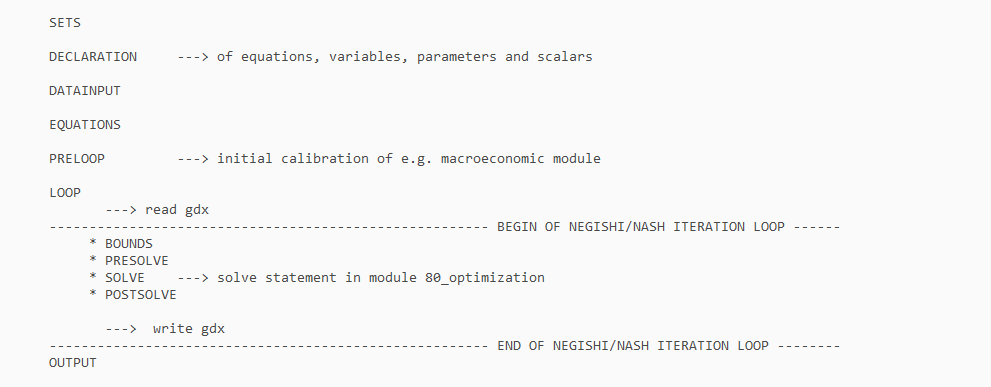

---
output:
  html_document: default
  pdf_document: default
---
Advanced: Change REMIND GAMS Code
================
Florian Humpenöder (<humpenoeder@pik-potsdam.de>), Lavinia Baumstark (<baumstark@pik-potsdam.de>)


Technical Structure
=====================
The REMIND-code is structured in a modular way. The technical structure looks as follows: At the top level you find the folders config, core, modules and scripts. The overall structure is built in the file main.gms. All settings and configuration information are given in the config folder.The core folder contains all files that are part of the core of the REMIND model. For each module there exists a sub-folder in the modules folder. Helpful scripts for e.g. starting a run or analysing results you find in the scripts folder.

In the main.gms the technical structure of REMIND can be found. First, the *.gms files from the core folder are included and afterward the *.gms files from the activated module realization, beginning with the one with the smallest module-number. The technical structure of REMIND looks as follows:


<p class="caption">
Technical Structure of REMIND
</p>

In general, the .gms-files in each module realization can be the same as in the core. For each module it has to be clearly defined what kind of interfaces it has with the core part of the model.

Coding Etiquette
==================
The REMIND GAMS code folllows a coding etiquette.

#### Naming conventions:
Please put effort into choosing intelligible names.

* Don't just enumerate existing names: budget1/budget2, tradebal1/tradebal2 will cause everyone for the next years much more frustration than if you choose names like emi_budget_G8/emi_budget_Mud, tradebal_res/tradebal_perm/tradebal_good
* Explain the abbreviation you designed in the dexcriptive text (the part with the " " behind each parameter/variable/equation declaration). "directteinv" is easier to memorize if you know it means "Direct technology investment".
* Within REMIND files: Use Capitalization to improve readability: XpPerm is more easily translated into "Export of Permits" than xpperm, the first part of the name (after the prefix) should describe the type of parameter/variable (e.g. "sh" for share, "cap" for capacity, "prod" for production, "dem" for demand, "cost" for costs)

#### Prefixes:
Use the following *prefixes*:

* "q_" to designate equations,
* "v_" to designate variables,
* "s_" to designate scalars,
* "f_" to designate file parameters (parameters that contain unaltered data read in from input files),
* "o_" to designate output parameters (parameters that do not affect the optimization, but are affected by it),
* "c_" to designate switches (parameters that enable different configuration choices),
* "s_FIRSTUNIT_2_SECONDUNIT" to designate a scalar used to convert from the FIRSTUNIT to the SECONDUNIT 
                             through multiplication, e.g. s_GWh_2_EJ.

These prefixes are extended in some cases by a second letter:

* "?m_" to designate objects used in the core and in at least one module.
* "?00_" to designate objects used in a single module, exclusively, with the 2-digit number corresponding 
         to the module number.

Sets are treated differently: instead of a prefix, sets exclusively used within a module get that module's 
number added as a suffix. If the set is used in more than one module no suffix is given. 
 
The units (e.g., TWa, EJ, GtC, GtCO2, ...) of variables and parameters are documented in the declaration files.

#### Commenting:

* Comment all parts of the code generously
* For all equations, it should become clear from the comments what part of the equation is supposed to do what
* Variables and parameters should be declared along with a descriptive text (use " " for descriptive text to avoid compilation errors)
* Use three asterisks *** for comments or *' if the comment should show up in the documentation of REMIND 
* Never use 4 asterisks (reserved for GAMS error messages)
* Don't use the string "infes" in comments
* Don't use $+number combinations, e.g., $20 (this interferes with GAMS error codes).
* Indicate the end of a file by inserting \*** EOF filename.inc \*** 

#### Equations:
The general idea is not to write code and equations as short as possible, but to write them in a way they can be read and understood as fast as possible. To that end:

* Write the mathematical operator (*, /, +, -) at the beginning of a line, not the end of the last line
* Leave a space before and after + and - operators and equation signs (=g=, =l=, =e=)
* Leave a space behind the comma of a sum (not behind the commas in set element calling)
* Use indentions to make the structure more readable
* Use full quotes ("feel") instead of single quotes ('feel') when specifying individual elements of a set (this makes automatic replacement via sed easier)
* Put the equation sign (=g=, =l=, =e=) in a single line without anything else


#### Other general rules:
* Decompose large model equations into several small equations to enhance readability and model diagnostics
* Don't use hard-coded numbers in the equations part of the model
* Parameters should not be overwritten in the initialization part of the models. Use if-statements instead. Notable exceptions include parameters that are part a loop iteration, e.g. Negishi weights.
* Have your work double-checked! To avoid bugs and problems: If you make major changes to your code, ask an experienced colleague to review the changes before they are pushed to the git main repository.
* Use sets and subsets to avoid redundant formulation of code (e.g., for technology groups)
* If big data tables are read in exclude them from the .lst-file (by using $offlisting and $onlisting), nevertheless display the parameter afterwards for an easier debugging later on
* When declaring a parameter/variable/equation always add the sets it is declared for, e.g. "parameter test(x,y);" instead of "parameter test;"
* do not set variables for all set entries to zero (if not necessary), as this will blow up memory requirements.

How to make a new module or realization in REMIND
========================================================

If you want to create a **new module** in REMIND first think about the interfaces between the core code and your new module. This helps you to design your module. 

For creating a new module you can use the function **module.skeleton** from the R package "gms". Start R and set the working directory to the folder of your REMIND version you want to make the changes (e.g. setwd(../../remind_20/trunk)). 

``` r
library(gms)
module.skeleton(100,"bla",c("on","off"))
```

It creates all folders and gams files for your new module "100_bla" with the realizations "on" and "off". More information about the function module_skeleton you can find at the help desk of R. 

For creating a **new realization** of an existing module you can also use the function module_skeleton of the R package "gms". Go into the folder "module" of your REMIND version and there in the folder of the module you want to make a new realization for (e.g. "module/100_bla", "module/10_climate"). Now you can start R and set the working directory to the head folder of your REMIND version you want to introduce the new realization. 

``` r
library(gms)
module.skeleton(100,"bla",c("on","off","new"))
```
It creates all additional gams files for your new realization "new" of the existing module "100_bla". More information about the function module_skeleton you can find at the help desk of R. 

After you have created all of your new files and lines for the new module or realization you have to add the description of this new feature in both the *main.gms* and in the *default.cfg* by hand.

Compiling
=============

Using the
``` bash
cfg$action
```
option in **config/default.cfg** you can choose whether you want to start a run or simply check if your code compiles. By setting the option to simply "c" (for compile), your code will only be tested and no SLURM job will start on the cluster (helps when the cluster is full). Default value for the option is "ce" (for compile and execute).

You can also compile the file *main.gms* directly by running the command
``` bash
gams main.gms -a=c -errmsg=1
```
This has the additional advantage of telling you in which exact file a compilation error occurred and running really fast. However, this will not take into consideration the changes you made to *./config/default.cfg*. So if you want to test changes you made to a non-standard module realization, be sure to update the settings in *main.gms* by either editing it manually or running *start.R* for a couple of seconds, until you see "The model folder was locked by this process" and then cancel the execution (so that no run job is submitted). This will modify *main.gms* with the entries of config/default.cfg (similarly possible with start_bundle.R with a scenario_config...csv with one row with start = 1 and all gdx columns providing an existing gdx file path, which is then used for updating main.gms).


