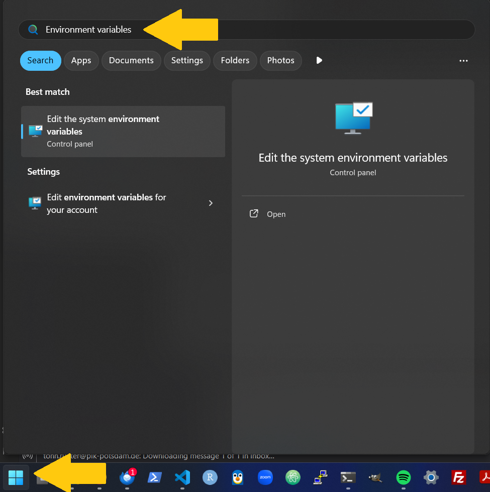
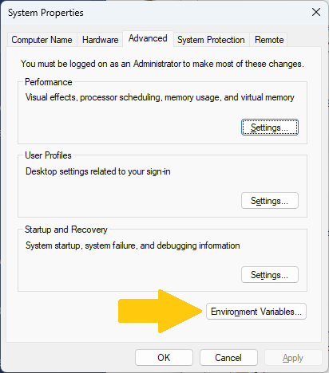
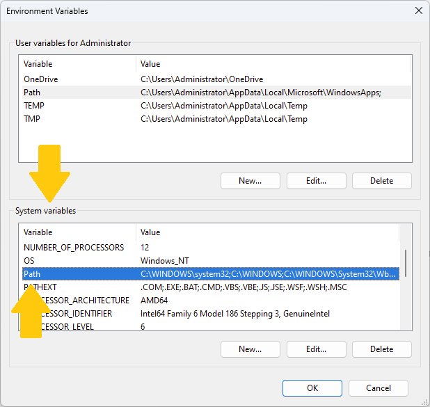
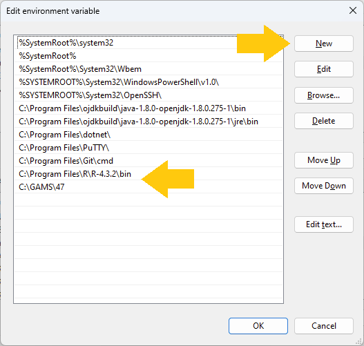

# Required software

REMIND requires some auxiliary software to run. Please make sure you have the following software installed on your system. To ensure interoperability with REMIND, the version of the software should match the versions given in the list below. *Note*: an `X` in a version string denotes a wildcard that can be any number:

- `GAMS` (version `47.X`) from [here](https://www.gams.com/47/)
    - *Note*: GAMS is proprietary software and requires a license key to run. In case you do not already have a GAMS license, we can provide you with a temporary one. Please refer to the [GAMS license](#gams-license) section below.
- `R` (version `4.3.X`): 
    - *Linux installation procedure*: R is distributed by a number of popular Linux distributions. On Ubuntu, for instance, open a terminal and run
        ```bash
        sudo apt-get install r-base # Requires administrator privileges
        ```
        Further installation instructions (e.g., for non-Ubuntu Linux) can be found on the [`R` homepage](https://cran.r-project.org/bin/linux/ubuntu/fullREADME.html)
    - The *Windows installation procedure* is a bit more involved. Download the `R-4.3.2-win.exe` installer [here](https://cran.r-project.org/bin/windows/base/old/4.3.2/), as well as `Rtools43` (installation instructions can be found [here](https://cran.r-project.org/bin/windows/Rtools/), the installer itself [here](https://cran.r-project.org/bin/windows/Rtools/rtools43/files/rtools43-5958-5975.exe))
    - *Optional*: To view and edit GAMS and R source code, please have a text editor installed. We recommend using [RStudio](https://posit.co/download/rstudio-desktop/)
- `git`: We use the version control software `git` to download REMIND and keep track of changes to the source code. Follow the official [installation instructions](https://git-scm.com/book/en/v2/Getting-Started-Installing-Git) for your system.
- *On Windows* After the installations, please make sure to add the GAMS installation directory to the PATH environmental variable of your operating system. The process for Windows [is described below](#configure-remind-related-environment-variables-in-windows)

# Installing REMIND

The REMIND installation procedure is mediated by the version control software git. Version control is essential to collaborative software development. This paragraph briefly outlines our approach to obtain and personalize the source code of REMIND. If not otherwise specified, run these commands in a shell (for Linux we recommend `bash`, for Windows we recommend `PowerShell`).

- Set-up an user account on [github.com](https://github.com/) or use your existing account
- In a terminal, navigate to the directory in which you want to store the REMIND folder. Clone the REMIND source code by running 
    ```bash
    git clone https://github.com/remindmodel/remind.git remind
    ```
- Change into the newly created directory and check out the workshop version of REMIND:
    ```bash
    cd remind # Assuming you cloned remind as described above
    git checkout workshop2024
    ``` 
- Start R once in the `remind` folder to initiate the R environment and test the installation. In a terminal, navigate to the folder into which you just cloned REMIND (`remind` in the above example), then  on *Linux* simply type `R` (on *Windows* type `R.exe`) and hit enter

# GAMS license

We have acquired a GAMS license for all participants in the REMIND Workshop for external users. Please note that the license will expire on *December 06, 2024*. To install the license, copy the following six lines to the clipboard. Then, open GAMS Studio and click on `Help > GAMS Licensing` or `Help > About GAMS`, depending on your version of GAMS Studio. A message box will notify you that a GAMS license has been found on the clipboard. If 'Yes' is clicked, the new license will be installed automatically and presented via the "About GAMS" dialog.

```
Course_License_________________________________S241106|0002AO-GEN
Potsdam-Institut_f._Klimafolgenforschung_e.V.,___________________
1382890301BACOCPKNM5GEPTSN_______________________________________
21250202010101010101010101_______________________________________
DCE3853______g_7_______________________________A_Course__________
License_Admin:_Lavinia.Baumstark@pik-potsdam.de__________________
```

For more detailed installation instructions, you can please consult the [GAMS Support Website](https://www.gams.com/latest/docs/UG_MAIN.html#UG_INSTALL)

# Configure REMIND-related environment variables in Windows

While the installation procedure for `GAMS` and `R` on Linux should set you up with all necessary information to run the programs *from the command line*, the process for Windows does not do that. A typical symptom of the problem is the following error when trying to run `R.exe` in a PowerShell terminal:

```PowerShell
PS C:\Users\tonnru\remind> R.exe
R.exe : The term 'R.exe' is not recognized as the name of a cmdlet, function, script file, or operable program. Check the spelling of the name, or if a path was included, verify that the path is correct
and try again.
At line:1 char:1
+ R.exe
+ ~~~~~~~
    + CategoryInfo          : ObjectNotFound: (R.exe:String) [], CommandNotFoundException
    + FullyQualifiedErrorId : CommandNotFoundException
```

We need to tell Windows where to find the executables for `GAMS` and `R`. This can achieved by adding the respective locations to the `PATH` environmental variable. First, locate the folders containing `gams.exe` resp. `R.exe` on your system. For `GAMS` this should be `C:\GAMS\47`, for `R.exe` this should be `C:\Program Files\R\R-4.3.2\bin` if you used the default installations. Then hit the `⊞ Win`-key or directly select the start menu. In the Start Menu, type "Environment variables":



Click on the "Environment Variables"-App. You'll be prompted to provide administrator credentials. A window titled "System Properties" opens. Click on the button labeled "Environmental Variables"



A new window open. In the lower half of the "Environmental Variables" window, in the "System variables" section look for the `Path` variable. Click on the "Edit" button below the selection box



A new window titled "Edit environment variable" opens. Click on button "New". A new line in the list appears. For `R`-executables paste the `C:\Program Files\R\R-4.3.2\bin` folder (or the correct location for your system). Click "New" again and add the `C:\GAMS\47` folder (or the correct location for your system) to add the `GAMS`-executables



Then close all windows by clicking the "OK" button. Re-start your terminal for the changes to take effect.