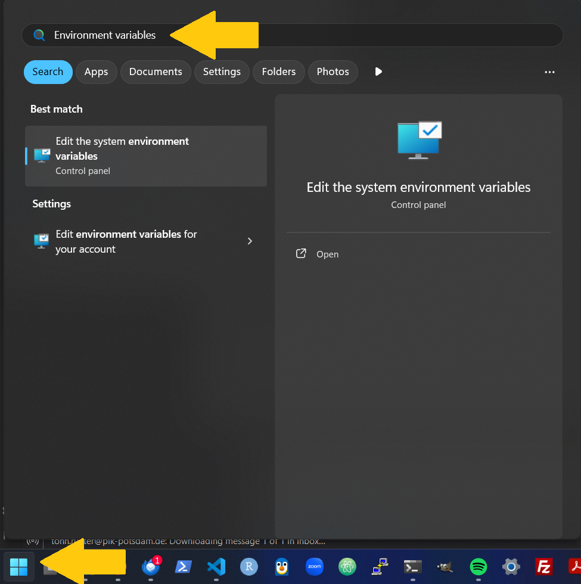
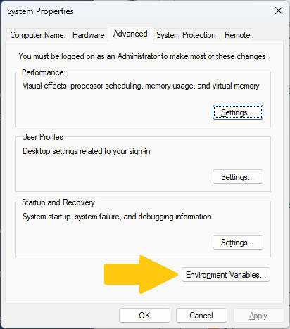
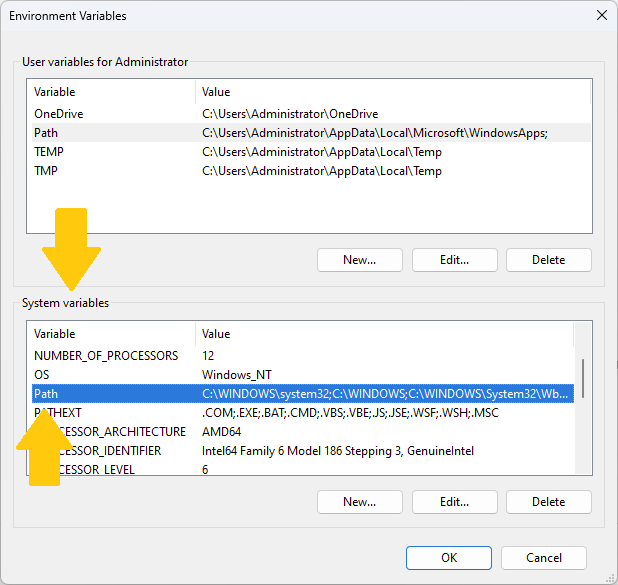
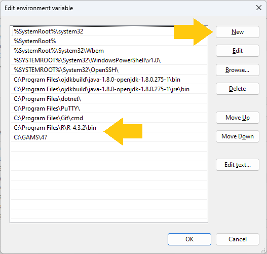

# Required software

REMIND requires some auxiliary software to run. Please make sure you have the following software installed on your system. To ensure interoperability with REMIND, the version of the software should match the versions given in the list below. *Note*: an `X` in a version string denotes a wildcard that can be any number:

- A shell program: We run
    - To ease debugging efforts, we recommend using a dedicated shell programm instead of using the integrated shell of an development environment
    - *for Windows* we highly recommend the use of `PowerShell`. Comes with any current Windows installation and provides a much better experience than the. To start it, press the <kbd>⌘ Win</kbd> key and type `PowerShell`
    - *for Linux* we recommend `bash`
- `GAMS` (version `51.X`) from [here](https://www.gams.com/51/)
    - *Note*: GAMS is proprietary software and requires a license key to run. In case you do not already have a GAMS license, we can provide you with a temporary one. Please refer to the [GAMS license](#gams-license) section below.
- `R` (version `4.3.X`): 
    - *Linux installation procedure*: R is distributed by a number of popular Linux distributions. On Ubuntu, for instance, open a terminal and run
        ```bash
        sudo apt-get install r-base # Requires administrator privileges
        ```
        Further installation instructions (e.g., for non-Ubuntu Linux) can be found on the [`R` homepage](https://cran.r-project.org/bin/linux/ubuntu/fullREADME.html)
    - The *Windows installation procedure* is a bit more involved. Download the `R-4.3.2-win.exe` installer [here](https://cran.r-project.org/bin/windows/base/old/4.3.2/), as well as `Rtools43` (installation instructions can be found [here](https://cran.r-project.org/bin/windows/Rtools/), the installer itself [here](https://cran.r-project.org/bin/windows/Rtools/rtools43/files/rtools43-5958-5975.exe))
    - *Optional*: To view and edit GAMS and R source code, please have a text editor installed. We recommend using [RStudio](https://posit.co/download/rstudio-desktop/)
    - *Optional*: Test your `R` installation by running `R.exe --version` on Windows resp. `R --version` on Linux
- `git`: We use the version control software `git` to download REMIND and keep track of changes to the source code. Follow the official [installation instructions](https://git-scm.com/install/) for your system.
- *On Windows* After the installations, please make sure to add the GAMS installation directory to the PATH environmental variable of your operating system. The process for Windows [is described below](#configure-remind-related-environment-variables-in-windows)

# Installing REMIND

The REMIND installation procedure is mediated by the version control software git. Version control is essential to collaborative software development. This paragraph briefly outlines our approach to obtain and personalize the source code of REMIND. If not otherwise specified, run these commands in a shell program.

- Set-up an user account on [github.com](https://github.com/) or use your existing account
- In a terminal, navigate to the directory in which you want to store the REMIND directory. Clone the REMIND source code by running 
    ```bash
    git clone https://github.com/remindmodel/remind.git remind
    ```
- Change into the newly created directory and check out the workshop version of REMIND:
    ```bash
    cd remind # Assuming you cloned remind as described above
    git checkout workshop2025
    ``` 
- Start R once in the `remind` folder to initiate the R environment and test the installation. In a terminal, navigate to the folder into which you just cloned REMIND (`remind` in the above example), then  on *Linux* simply type `R` (on *Windows* type `R.exe`) and hit enter

# GAMS license

We have acquired a GAMS license for all participants in the REMIND Workshop for external users. Please note that the license will expire on *December 06, 2024*. To install the license, copy the following six lines to the clipboard. Then, open GAMS Studio and click on `Help > GAMS Licensing` or `Help > About GAMS`, depending on your version of GAMS Studio. A message box will notify you that a GAMS license has been found on the clipboard. If 'Yes' is clicked, the new license will be installed automatically and presented via the "About GAMS" dialog.

```
Course_License_________________________________G250902+0003Ac-GEN
Potsdam-Institut_f._Klimafolgenforschung_e.V.____________________
01BACOCPKNM5GEPTSN_______________________________________________
030303030303030303_______________________________________________
DCE4743___2b88c70f-9ca5-4b5a-8292-bab1c59420e9_N_COURSE__________
server:license.gams.com_port:443_v:2_____________________________
MEYCIQDYoTm2TovAXSsWmHDB92njpV2mt6TWoNG92dN4Fj9ouAIhALWJx0v02f+D7
G+HygEojhzXzLLldk0wDESy3GMbABFX__________________________________
```

For more detailed installation instructions, you can please consult the [GAMS Support Website](https://www.gams.com/latest/docs/UG_MAIN.html#UG_INSTALL)

# Configure REMIND-related environment variables in Windows

While the installation procedure for `GAMS` and `R` on Linux should set you up with all necessary information to run the programs *from the command line*, the process for Windows does not do that. A typical symptom of the problem is the following error when trying to run `R.exe` in a PowerShell terminal:

```PowerShell
PS C:\Users\tonnru\remind> R.exe
R.exe : The term 'R.exe' is not recognized as the name of a cmdlet, function, script file, or operable program. Check the spelling of the name, or if a path was included, verify that the path is correct
and try again.
At line:1 char:1
+ R.exe
+ ~~~~~~~
    + CategoryInfo          : ObjectNotFound: (R.exe:String) [], CommandNotFoundException
    + FullyQualifiedErrorId : CommandNotFoundException
```

We need to tell Windows where to find the executables for `GAMS` and `R`. This can achieved by adding the respective locations to the `PATH` environmental variable. First, locate the folders containing `gams.exe` resp. `R.exe` on your system. For `GAMS` this should be `C:\GAMS\51`, for `R.exe` this should be `C:\Program Files\R\R-4.3.2\bin` if you used the default installations. Then hit the `? Win`-key or directly select the start menu. In the Start Menu, type "Environment variables":



Click on the "Environment Variables"-App. You'll be prompted to provide administrator credentials. A window titled "System Properties" opens. Click on the button labeled "Environmental Variables"



A new window open. In the lower half of the "Environmental Variables" window, in the "System variables" section look for the `Path` variable. Click on the "Edit" button below the selection box



A new window titled "Edit environment variable" opens. Click on button "New". A new line in the list appears. For `R`-executables paste the `C:\Program Files\R\R-4.3.2\bin` folder (or the correct location for your system). Click "New" again and add the `C:\GAMS\51` folder (or the correct location for your system) to add the `GAMS`-executables



Then close all windows by clicking the "OK" button. Re-start your terminal for the changes to take effect.

## Verify `PATH` environment variables are correctly set

In your shell program run

```PowerShell
$env:PATH -split [System.IO.Path]::PathSeparator | ForEach-Object { $_.Trim() } | Where-Object { $_ -ne '' } | Sort-Object -Unique
```

on Windows or

```bash
echo "$PATH" | tr ':' '\n' | awk '{$1=$1} NF' | sort -u
```

on Linux. The printed lines should include

```PowerShell
# The GAMS directory ..
C:\GAMS\51
C:\GAMS\51\gbin
# .. and your R installation
C:\Users\tonnru\AppData\Local\Programs\R\R-4.3.2\bin\x64
```

# Run a quick REMIND test

In your terminal, navigate to the REMIND directory (contains amongst others `start.R` file). Type

```PowerShell
Rscript start.R --testOneRegi
```

to run a quick test of the REMIND installation. Especially the first run can take a while, since it will install all `R` dependencies. After some time your terminal output will show something similar to

```PowerShell
2025-11-13 14:48:01: Creating full.gms
2025-11-13 14:48:15: unlocked model.

Starting REMIND...
GAMS will provide logging in full.log.
```

Open another terminal to observe the progress of the GAMS solver during the REMIND run with 

```PowerShell
Get-Content -Tail 10 -Wait output\testOneRegi\full.log
```

on Windows and 

```bash
tail -f output/testOneRegi/full.log
```

on Linux. A typical model summary printed to your shell programm after completion reads

```PowerShell
Model summary:
  gams_runtime is 43.5 mins.
  full.gms exists, so the REMIND GAMS code was generated.
  full.log and full.lst exist, so GAMS did run.
  abort.gdx does not exist, a file written automatically for some types of errors.
  non_optimal.gdx exists, because iteration 1 did not find a locally optimal solution. modelstat: 7 (Intermediate Nonoptimal)
! fulldata.gdx does not exist, so output generation will fail. # <--- This is expected for the test run
  Modelstat after 1 iterations: 7 (Intermediate Nonoptimal)    # <--- Single iteration
  full.log states: *** Status: Normal completion
```

Disregard possible errors like

```PowerShell
Collect and submit run statistics to central data base.
Cannot access run statistics repository /p/projects/rd3mod/models/statistics/remind Run statistics are not submitted.
```

as they pertain to certain tools only available on the PIK high performance cluster and are irrelevant to running the test case.

# Start SSP2 scenario REMIND runs

Use the `scenario_config_ws25.csv` to start a `SSP2-NPi2025` run followed by a `SSP2-PkBdgt650` scenario

```PowerShell
Rscript start.R config/scenario_config_ws25.csv
```

You can track the output as before. *Do not* close the shell programm window from which the run was started as this will terminate the REMIND run.

*Note* In case the `SSP2-PkBdgt650` does not automatically start after the `SSP2-NPi2025` run has finished, edit the `scenario_config_ws25.csv` by putting a `0` in the `start` column of the `SSP2-NPi2025` scenario line and re-run the above command.

## Check on runs after completion

On Windows, run

```PowerShell
Select-String "output\<run folder>\full.log" -Pattern "(\*\*\* Status: (Normal completion|Execution error\(s\))|LOOPS iteration = )" | Select-Object -Last 2
```

in PowerShell to check on the exit status and the overall number of iterations of your REMIND run. The same command on Linux is

```
grep -E "(\*\*\* Status: (Normal completion|Execution error\(s\))|LOOPS iteration = )" output/SSP2-PkBudg650_2025-11-13_18.28.33/full.log | tail -2
```

A typical output of the commands looks like

```PowerShell
> Select-String "output\SSP2-PkBudg650_2025-11-13_18.28.33\full.log" -Pattern "(\*\*\* Status: (Normal completion|Execution error\(s\))|LOOPS iteration = )" | Select-Object -Last 2

output\SSP2-PkBudg650_2025-11-13_18.28.33\full.log:10385:--- LOOPS iteration = 44
output\SSP2-PkBudg650_2025-11-13_18.28.33\full.log:10448:*** Status: Normal completion
```

indicating `Normal completion` after 44 iterations.

# Output Analysis

## REMIND Reporting

*Note*: If you've experienced difficulties with running REMIND or any of the scenarios on your PC you can download a tar archive of prepared REMIND output [at this link](https://rse.pik-potsdam.de/data/remind/public/prepared_output.tar.gz). Move the `prepared_output.tar.gz` from your `Downloads` directory into the REMIND directory. Extract contents of the tar archive and place them into the `output` subdirectory of your REMIND folder by running

```PowerShell
tar -xzf prepared_output.tar.gz -C output # This should work on both PowerShell and bash
```

Verify the availability of output folders by running `ls output` in your REMIND directory. In case you are using the prepared output directory, the command shows directories `SSP2-NPi2025_2025-11-14_00.24.00` and `SSP2-PkBudg650_2025-11-13_18.28.33`. If you've computed your own scenarios, the time stamps at the end of the directory name will be different, but they still have the `SSP2-NPi2025` and `SSP2-PkBudg650` prefixes.

### Start reporting

The REMIND reporting translates the ``fulldata.gdx`` to ``REMIND_generic_<scenario>.mif`` and ``REMIND_generic_<scenario>_withoutPlus.mif``.

To initiate the reporting type

```PowerShell
Rscript output.R
```

in your REMIND directory. Navigate the selection menu by typing a number and pressing <kbd>Enter</kbd>. The selection sequence for reporting goes:

- Press `1` for *single run*
- Press `13` or `14` for *reporting*
- A list of runs available for reporting will appear. Select the run(s) you want to run reporting on. *Note*
  - A single run corresponds to a single number, e.g. type `1`
  - A selection of runs can be provided as a comma separated list, e.g. type `1,2,5`
  - A sequence of runs is denoted by a colon, e.g. type `1:5`
  - All of the above can be combined

If you have trouble running the reporting on your machine, see the section above on how to download and extract the `prepared_output.tar.gz`.


## Compare scenarios

Documentation:

- Vignette: https://pik-piam.r-universe.dev/articles/remind2/compareScenariosRemind2.html
- Vignette: https://pik-piam.r-universe.dev/articles/piamPlotComparison/compareScenarios.html 


### REMIND script

Comparison of two or more scenarios is initiated as above by running 

```PowerShell
Rscript output.R
```

in your REMIND directory. The selection menu sequence for reporting goes:

- Press `2` for *Comparison across runs*
- Press `5` for *compareScenarios2*
- Select the run(s) you want to compare.
- Choose a prefix for filenames of `compareScenarios2`. Just type a prefix or leave empty
- Leave the cs2 profile selection empty or type `2` for the default profile

### From R Session

- Start a new R Session and load ``remind2`` and ``piamPlotComparison`` via 
```R
library(remind2)
library(piamPlotComparison)
```
- Execute
```
compareScenarios(
		projectLibrary = "remind2",
		mifScen = c("path/to/remind_scen1.mif",
					"path/to/remind_scen2.mif"), 
		mifHist =   "path/to/historical.mif")
```
- If you don't want to render the whole document, select specifi chapters via the argument `sections`, e.g. ``sections = 02`` for the macro chapter.

With the [`prepared_output.tar.gz`](https://rse.pik-potsdam.de/data/remind/public/prepared_output.tar.gz) extracted to the `output` folder in your REMIND directory, the above command becomes

```R
piamPlotComparison::compareScenarios(
    projectLibrary = "remind2",
    mifScen = c(
        "output/SSP2-NPi2025_2025-11-14_00.24.00/REMIND_generic_SSP2-NPi2025.mif",
        "output/SSP2-PkBudg650_2025-11-13_18.28.33/REMIND_generic_SSP2-PkBudg650.mif"
    ), 
    mifHist =   "output/SSP2-NPi2025_2025-11-14_00.24.00/historical.mif",
    #sections = 02 # Un-comment this line for a quicker compareScenarios run
)
```

Tou can run this diectly in an R session or paste it into a file. Assuming the file is called `runCompareScenarios.R`, start the comparison with in your shell program in the REMIND directory with `Rscript runCompareScenarios.R`. This will produce a `CompareScenarios.pdf` in your REMIND directory. Examples of the compare scenarios output [can be found here](https://rse.pik-potsdam.de/data/remind/public/compareScenarios/).

### Interactive Use

- clone remind2, create R project in folder
- run ``devtools::load_all(".")`` in the project root
- use interactively via argument ``outputFormat = "Rmd"``
- take a look at copied folder and make changes, e.g. in main.Rmd for preprocessing of data

## Validate scenarios

Documentation:

- Vignette: https://pik-piam.r-universe.dev/articles/piamValidation/validateScenarios.html 
- Paper: https://egusphere.copernicus.org/preprints/2025/egusphere-2025-2284/ 


### REMIND script
    
Same as ``compareScenarios``, however here it doesn't work because of missing reference data.

### From R Session

- download the [validationConfig_workshop25.csv](https://rse.pik-potsdam.de/data/remind/public/validationConfig_workshop25.csv)
- take a look inside to get an idea how checks are defined
- load ``library(piamValidation)``
- execute validation and return data including validation outcome:

```R
df <- validateScenarios(
        dataPath =	c("path/to/remind_scen1.mif",
                      "path/to/remind_scen2.mif", 
                      "path/to/historical.mif"), 
        config = "path/to/downloaded/validationConfig.csv")
```
- execute validation and also render a report with visualizations:
```R
validationReport(
        dataPath =	c("path/to/remind_scen1.mif",
                      "path/to/remind_scen2.mif", 
                      "path/to/historical.mif"), 
        config = "path/to/downloaded/validationConfig.csv")
```

### Interactive Use

- clone piamValidation, create R project in folder
- run ``devtools::load_all(".")`` in the project root
- make changes, like creating a custom Rmd report file or a new config


# Common pitfalls

## Version control with `git`

Common git pitfalls include not having the `workshop2025` branch active. Use `git status` in your REMIND directory to make sure you are on the `workshop2025` branch of the REMIND git repo

```PowerShell
> git status
On branch workshop2025 # <---
Your branch is up to date with 'origin/workshop2025'.

nothing to commit, working tree clean
```

### Update your REMIND branch

We'll cover an update routine that allows to accomodate changes made in the REMIND repository into your local copy.

```PowerShell
# Save all changes beforehand!
git stash # Optionally: Temporarily remove local changes 
git pull --rebase origin workshop2025
git stash apply # Add local changes
```

**Please note** that `git`, while essential in software engineering of large projects, is a somewhat complex tool that quickly cause issues when used inattentively.

## Can't find package `X`

This issue can have a myriad of reasons. Try making sure the `.Rprofile` incorporates [PIK-CRAN](https://rse.pik-potsdam.de/r/packages/) into your REMIND set-up. Run

```PowerShell
Rscript -e "renv::restore(lockfile='renv/archive/ws25_renv.lock'); renv::snapshot()"
```

in your REMIND directory to create a `renv.lock` file.

## Missing `tabu.sty` when running `compareScenarios`

Check whether a LaTeX installation is available by running

```PowerShell
Get-Command pdflatex | Select-Object Source
```

If the previous command comes up empty we recommend installing [MiKTeX](https://miktex.org/). Using an existing MiKTeX installation, make sure `tabu.sty` is available by running

```PowerShell
mpm --install=tabu
```